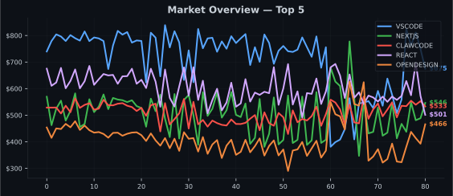

<div align="center">

# GitExchange

### The Stock Market for Open Source

**Trade GitHub repos like stocks. Prices driven by real stars, commits, and forks.**

Every repo is a ticker. Every issue is a trade. No signup, no wallet -- just your GitHub account.

🟢 **Market OPEN** | Total Cap: $3.22M | 20 Stocks | 2 Traders | Last Update: 2026-05-01 12:26 UTC

📈 **Top Gainer**: DENO +7.75% ($461.53) | 📉 **Top Loser**: NEXTJS -10.79% ($475.52)

---

[**Browse Market**](#market-board) | [**Leaderboard**](#leaderboard) | [**Start Trading**](#start-trading-now) | [**How It Works**](#how-prices-work)

</div>

---

## Quick Start

| Step | Action |
|:----:|--------|
| **1** | Click a **Buy** or **Sell** link below -- or open a new issue |
| **2** | Edit the quantity in the issue title (e.g. `BUY react 10`) |
| **3** | Submit -- your trade executes automatically and you get a receipt |
| **4** | Open an issue titled `PORTFOLIO` anytime to check your holdings |

> **Requirements** -- Your GitHub account must be at least **7 days old**. Limit: **5 trades per hour**.

---

## Start Trading Now

Pick a stock and open a trade in one click:

<div align="center">

| Buy | Sell | Short |
|:---:|:----:|:-----:|
| [Buy React](https://github.com/SolanaLeeky/GitExchange/issues/new?title=BUY+react+5&body=Adjust+quantity+then+submit) | [Sell React](https://github.com/SolanaLeeky/GitExchange/issues/new?title=SELL+react+5&body=Adjust+quantity+then+submit) | [Short React](https://github.com/SolanaLeeky/GitExchange/issues/new?title=SHORT+react+5&body=Adjust+quantity+then+submit) |
| [Buy VS Code](https://github.com/SolanaLeeky/GitExchange/issues/new?title=BUY+vscode+5&body=Adjust+quantity+then+submit) | [Sell VS Code](https://github.com/SolanaLeeky/GitExchange/issues/new?title=SELL+vscode+5&body=Adjust+quantity+then+submit) | [Short VS Code](https://github.com/SolanaLeeky/GitExchange/issues/new?title=SHORT+vscode+5&body=Adjust+quantity+then+submit) |
| [Buy Next.js](https://github.com/SolanaLeeky/GitExchange/issues/new?title=BUY+next.js+5&body=Adjust+quantity+then+submit) | [Sell Next.js](https://github.com/SolanaLeeky/GitExchange/issues/new?title=SELL+next.js+5&body=Adjust+quantity+then+submit) | [Short Next.js](https://github.com/SolanaLeeky/GitExchange/issues/new?title=SHORT+next.js+5&body=Adjust+quantity+then+submit) |
| [Buy Deno](https://github.com/SolanaLeeky/GitExchange/issues/new?title=BUY+deno+5&body=Adjust+quantity+then+submit) | [Sell Deno](https://github.com/SolanaLeeky/GitExchange/issues/new?title=SELL+deno+5&body=Adjust+quantity+then+submit) | [Short Deno](https://github.com/SolanaLeeky/GitExchange/issues/new?title=SHORT+deno+5&body=Adjust+quantity+then+submit) |

**[View Portfolio](https://github.com/SolanaLeeky/GitExchange/issues/new?title=PORTFOLIO&body=Submit+to+view+your+holdings)**

</div>

---

## Market Board

| Ticker | Name | Price | 24h Change | Volume | Market Cap | Trade |
|--------|------|-------|------------|--------|------------|-------|
| **VSCODE** | microsoft/vscode | $776.33 | 🔴 -2.38% | 3 | $388.2K | [Buy](https://github.com/SolanaLeeky/GitExchange/issues/new?title=BUY+vscode+10&body=Adjust+quantity+in+the+title+then+submit) [Sell](https://github.com/SolanaLeeky/GitExchange/issues/new?title=SELL+vscode+5&body=Adjust+quantity+in+the+title+then+submit) [Short](https://github.com/SolanaLeeky/GitExchange/issues/new?title=SHORT+vscode+10&body=Adjust+quantity+in+the+title+then+submit) |
| **REACT** | facebook/react | $634.60 | 🟢 +7.71% | 22 | $317.3K | [Buy](https://github.com/SolanaLeeky/GitExchange/issues/new?title=BUY+react+10&body=Adjust+quantity+in+the+title+then+submit) [Sell](https://github.com/SolanaLeeky/GitExchange/issues/new?title=SELL+react+5&body=Adjust+quantity+in+the+title+then+submit) [Short](https://github.com/SolanaLeeky/GitExchange/issues/new?title=SHORT+react+10&body=Adjust+quantity+in+the+title+then+submit) |
| **CLAWCODE** | ultraworkers/claw-code | $565.19 | 🟢 +2.41% | 0 | $282.6K | [Buy](https://github.com/SolanaLeeky/GitExchange/issues/new?title=BUY+clawcode+10&body=Adjust+quantity+in+the+title+then+submit) [Sell](https://github.com/SolanaLeeky/GitExchange/issues/new?title=SELL+clawcode+5&body=Adjust+quantity+in+the+title+then+submit) [Short](https://github.com/SolanaLeeky/GitExchange/issues/new?title=SHORT+clawcode+10&body=Adjust+quantity+in+the+title+then+submit) |
| **NEXTJS** | vercel/next.js | $475.52 | 🔴 -10.79% | 5 | $237.8K | [Buy](https://github.com/SolanaLeeky/GitExchange/issues/new?title=BUY+nextjs+10&body=Adjust+quantity+in+the+title+then+submit) [Sell](https://github.com/SolanaLeeky/GitExchange/issues/new?title=SELL+nextjs+5&body=Adjust+quantity+in+the+title+then+submit) [Short](https://github.com/SolanaLeeky/GitExchange/issues/new?title=SHORT+nextjs+10&body=Adjust+quantity+in+the+title+then+submit) |
| **DENO** | denoland/deno | $461.53 | 🟢 +7.75% | 2 | $230.8K | [Buy](https://github.com/SolanaLeeky/GitExchange/issues/new?title=BUY+deno+10&body=Adjust+quantity+in+the+title+then+submit) [Sell](https://github.com/SolanaLeeky/GitExchange/issues/new?title=SELL+deno+5&body=Adjust+quantity+in+the+title+then+submit) [Short](https://github.com/SolanaLeeky/GitExchange/issues/new?title=SHORT+deno+10&body=Adjust+quantity+in+the+title+then+submit) |
| **SVELTE** | sveltejs/svelte | $315.36 | 🔴 -1.41% | 6 | $157.7K | [Buy](https://github.com/SolanaLeeky/GitExchange/issues/new?title=BUY+svelte+10&body=Adjust+quantity+in+the+title+then+submit) [Sell](https://github.com/SolanaLeeky/GitExchange/issues/new?title=SELL+svelte+5&body=Adjust+quantity+in+the+title+then+submit) [Short](https://github.com/SolanaLeeky/GitExchange/issues/new?title=SHORT+svelte+10&body=Adjust+quantity+in+the+title+then+submit) |
| **PAPERCLIP** | paperclipai/paperclip | $301.59 | 🟢 +2.14% | 0 | $150.8K | [Buy](https://github.com/SolanaLeeky/GitExchange/issues/new?title=BUY+paperclip+10&body=Adjust+quantity+in+the+title+then+submit) [Sell](https://github.com/SolanaLeeky/GitExchange/issues/new?title=SELL+paperclip+5&body=Adjust+quantity+in+the+title+then+submit) [Short](https://github.com/SolanaLeeky/GitExchange/issues/new?title=SHORT+paperclip+10&body=Adjust+quantity+in+the+title+then+submit) |
| **GSTACK** | garrytan/gstack | $268.10 | 🔴 -2.35% | 20 | $134.1K | [Buy](https://github.com/SolanaLeeky/GitExchange/issues/new?title=BUY+gstack+10&body=Adjust+quantity+in+the+title+then+submit) [Sell](https://github.com/SolanaLeeky/GitExchange/issues/new?title=SELL+gstack+5&body=Adjust+quantity+in+the+title+then+submit) [Short](https://github.com/SolanaLeeky/GitExchange/issues/new?title=SHORT+gstack+10&body=Adjust+quantity+in+the+title+then+submit) |
| **AUTORESEARCH** | karpathy/autoresearch | $254.14 | 🟢 +5.56% | 0 | $127.1K | [Buy](https://github.com/SolanaLeeky/GitExchange/issues/new?title=BUY+autoresearch+10&body=Adjust+quantity+in+the+title+then+submit) [Sell](https://github.com/SolanaLeeky/GitExchange/issues/new?title=SELL+autoresearch+5&body=Adjust+quantity+in+the+title+then+submit) [Short](https://github.com/SolanaLeeky/GitExchange/issues/new?title=SHORT+autoresearch+10&body=Adjust+quantity+in+the+title+then+submit) |
| **NEMOCLAW** | NVIDIA/NemoClaw | $249.80 | 🟢 +2.96% | 0 | $124.9K | [Buy](https://github.com/SolanaLeeky/GitExchange/issues/new?title=BUY+nemoclaw+10&body=Adjust+quantity+in+the+title+then+submit) [Sell](https://github.com/SolanaLeeky/GitExchange/issues/new?title=SELL+nemoclaw+5&body=Adjust+quantity+in+the+title+then+submit) [Short](https://github.com/SolanaLeeky/GitExchange/issues/new?title=SHORT+nemoclaw+10&body=Adjust+quantity+in+the+title+then+submit) |
| **MEMPALACE** | milla-jovovich/mempalace | $244.34 | 🔴 -5.67% | 0 | $122.2K | [Buy](https://github.com/SolanaLeeky/GitExchange/issues/new?title=BUY+mempalace+10&body=Adjust+quantity+in+the+title+then+submit) [Sell](https://github.com/SolanaLeeky/GitExchange/issues/new?title=SELL+mempalace+5&body=Adjust+quantity+in+the+title+then+submit) [Short](https://github.com/SolanaLeeky/GitExchange/issues/new?title=SHORT+mempalace+10&body=Adjust+quantity+in+the+title+then+submit) |
| **AWESOMEDESIGNMD** | VoltAgent/awesome-design-md | $234.97 | 🔴 -1.55% | 0 | $117.5K | [Buy](https://github.com/SolanaLeeky/GitExchange/issues/new?title=BUY+awesomedesignmd+10&body=Adjust+quantity+in+the+title+then+submit) [Sell](https://github.com/SolanaLeeky/GitExchange/issues/new?title=SELL+awesomedesignmd+5&body=Adjust+quantity+in+the+title+then+submit) [Short](https://github.com/SolanaLeeky/GitExchange/issues/new?title=SHORT+awesomedesignmd+10&body=Adjust+quantity+in+the+title+then+submit) |
| **OPENCLAUDE** | Gitlawb/openclaude | $234.15 | 🟢 +0.19% | 0 | $117.1K | [Buy](https://github.com/SolanaLeeky/GitExchange/issues/new?title=BUY+openclaude+10&body=Adjust+quantity+in+the+title+then+submit) [Sell](https://github.com/SolanaLeeky/GitExchange/issues/new?title=SELL+openclaude+5&body=Adjust+quantity+in+the+title+then+submit) [Short](https://github.com/SolanaLeeky/GitExchange/issues/new?title=SHORT+openclaude+10&body=Adjust+quantity+in+the+title+then+submit) |
| **CAVEMAN** | JuliusBrussee/caveman | $230.52 | 🟢 +2.15% | 0 | $115.3K | [Buy](https://github.com/SolanaLeeky/GitExchange/issues/new?title=BUY+caveman+10&body=Adjust+quantity+in+the+title+then+submit) [Sell](https://github.com/SolanaLeeky/GitExchange/issues/new?title=SELL+caveman+5&body=Adjust+quantity+in+the+title+then+submit) [Short](https://github.com/SolanaLeeky/GitExchange/issues/new?title=SHORT+caveman+10&body=Adjust+quantity+in+the+title+then+submit) |
| **CAREEROPS** | santifer/career-ops | $225.12 | 🔴 -4.84% | 0 | $112.6K | [Buy](https://github.com/SolanaLeeky/GitExchange/issues/new?title=BUY+careerops+10&body=Adjust+quantity+in+the+title+then+submit) [Sell](https://github.com/SolanaLeeky/GitExchange/issues/new?title=SELL+careerops+5&body=Adjust+quantity+in+the+title+then+submit) [Short](https://github.com/SolanaLeeky/GitExchange/issues/new?title=SHORT+careerops+10&body=Adjust+quantity+in+the+title+then+submit) |
| **GRAPHIFY** | safishamsi/graphify | $223.28 | 🟢 +3.70% | 0 | $111.6K | [Buy](https://github.com/SolanaLeeky/GitExchange/issues/new?title=BUY+graphify+10&body=Adjust+quantity+in+the+title+then+submit) [Sell](https://github.com/SolanaLeeky/GitExchange/issues/new?title=SELL+graphify+5&body=Adjust+quantity+in+the+title+then+submit) [Short](https://github.com/SolanaLeeky/GitExchange/issues/new?title=SHORT+graphify+10&body=Adjust+quantity+in+the+title+then+submit) |
| **CLI** | googleworkspace/cli | $201.48 | 🟢 +4.16% | 0 | $100.7K | [Buy](https://github.com/SolanaLeeky/GitExchange/issues/new?title=BUY+cli+10&body=Adjust+quantity+in+the+title+then+submit) [Sell](https://github.com/SolanaLeeky/GitExchange/issues/new?title=SELL+cli+5&body=Adjust+quantity+in+the+title+then+submit) [Short](https://github.com/SolanaLeeky/GitExchange/issues/new?title=SHORT+cli+10&body=Adjust+quantity+in+the+title+then+submit) |
| **PRETEXT** | chenglou/pretext | $186.84 | 🔴 -10.03% | 0 | $93.4K | [Buy](https://github.com/SolanaLeeky/GitExchange/issues/new?title=BUY+pretext+10&body=Adjust+quantity+in+the+title+then+submit) [Sell](https://github.com/SolanaLeeky/GitExchange/issues/new?title=SELL+pretext+5&body=Adjust+quantity+in+the+title+then+submit) [Short](https://github.com/SolanaLeeky/GitExchange/issues/new?title=SHORT+pretext+10&body=Adjust+quantity+in+the+title+then+submit) |
| **CLIANYTHING** | HKUDS/CLI-Anything | $184.55 | 🔴 -6.25% | 5 | $92.3K | [Buy](https://github.com/SolanaLeeky/GitExchange/issues/new?title=BUY+clianything+10&body=Adjust+quantity+in+the+title+then+submit) [Sell](https://github.com/SolanaLeeky/GitExchange/issues/new?title=SELL+clianything+5&body=Adjust+quantity+in+the+title+then+submit) [Short](https://github.com/SolanaLeeky/GitExchange/issues/new?title=SHORT+clianything+10&body=Adjust+quantity+in+the+title+then+submit) |
| **NUWASKILL** | alchaincyf/nuwa-skill | $169.04 | 🔴 -0.80% | 0 | $84.5K | [Buy](https://github.com/SolanaLeeky/GitExchange/issues/new?title=BUY+nuwaskill+10&body=Adjust+quantity+in+the+title+then+submit) [Sell](https://github.com/SolanaLeeky/GitExchange/issues/new?title=SELL+nuwaskill+5&body=Adjust+quantity+in+the+title+then+submit) [Short](https://github.com/SolanaLeeky/GitExchange/issues/new?title=SHORT+nuwaskill+10&body=Adjust+quantity+in+the+title+then+submit) |

---

## Leaderboard

| Rank | Trader | Portfolio Value | P&L | Trades | Achievements |
|------|--------|-----------------|-----|--------|--------------|
| 🥇 | @SolanaLeeky | $12,341.53 | +$2,341.53 (+23.4%) | 12 | 🦊 🎯 🐦 🔔 💎 |
| 🥈 | @neurobytex | $9,402.98 | -$597.02 (-6.0%) | 1 | 🎯 💎 🦊 |

---

## Price Chart (7 days)



---

## Recent Trades

*No trades yet.*

---

## Trading Commands

```
BUY   <ticker> <qty>     Buy shares              BUY react 10
SELL  <ticker> <qty>     Sell shares you own      SELL vscode 5
SHORT <ticker> <qty>     Bet on price drop        SHORT deno 20
COVER <ticker> <qty>     Close a short            COVER deno 20
PORTFOLIO                View your holdings
```

---

## Rules at a Glance

| | |
|---|---|
| **Starting cash** | $10,000 |
| **Trade size** | 1 -- 100 shares |
| **Max position** | 40% of portfolio in one stock |
| **Trading fee** | 0.1% per trade |
| **Short margin** | 150% of position value |
| **Price updates** | Every 6 hours via GitHub API |
| **Dividends** | Daily -- 0.5% of price to holders of repos with 50+ commits/week |

---

## How Prices Work

Stock prices reflect five real GitHub metrics, updated every 6 hours:

| Metric | Weight | What It Measures |
|--------|:------:|------------------|
| Stars | 30% | Community interest |
| Commits / week | 25% | Development momentum |
| Forks | 15% | Ecosystem adoption |
| Issue response time | 15% | Maintainer health |
| Contributors | 15% | Team breadth |

Momentum (trend-following, capped at 8%) and volatility (random +/-3%) are applied on top.

---

## Market Events

| Event | Trigger | Effect |
|-------|---------|--------|
| **IPO** | Trending repo hits 1,000+ stars | Auto-listed on the exchange |
| **Crash** | Repo archived or deleted | Price drops to $0 -- holders wiped |
| **Short Squeeze** | Short interest > 60% and price rises 10%+ | All shorts force-closed |
| **Dividends** | Repo has 50+ commits/week | Daily payout to shareholders |

---

## Achievements

| Badge | Name | How to Earn |
|:-----:|------|-------------|
| :dart: | **First Trade** | Complete your first trade |
| :100: | **Century Trader** | Make 100 trades |
| :rocket: | **10x Return** | Portfolio value reaches 10x starting cash |
| :gem: | **Diamond Hands** | Hold a stock for 30+ days |
| :page_facing_up: | **Paper Hands** | Sell within 1 hour of buying |
| :crown: | **Short King** | Profit $5,000+ from short positions |
| :globe_with_meridians: | **Diversified** | Hold 10+ different stocks |
| :whale: | **Whale** | Single trade worth $5,000+ |
| :shield: | **Survivor** | Hold a stock through a crash event |
| :bell: | **IPO Hunter** | Buy a stock on its IPO day |

---

## Profile Badge

Show off your trading stats on your GitHub profile! Open a `PORTFOLIO` issue to get your personalized badge with embed code.

**Example:**

[](https://github.com/SolanaLeeky/GitExchange)

Your badge updates automatically with every price update — rank, P&L, portfolio value, and trade count stay current.

---

<div align="center">

**GitExchange** -- Powered by GitHub Actions.

Prices update every 6 hours. Market data is committed to this repo.

[Open a Trade](https://github.com/SolanaLeeky/GitExchange/issues/new/choose) | [View Portfolio](https://github.com/SolanaLeeky/GitExchange/issues/new?title=PORTFOLIO&body=Submit+to+view+your+holdings)

</div>
