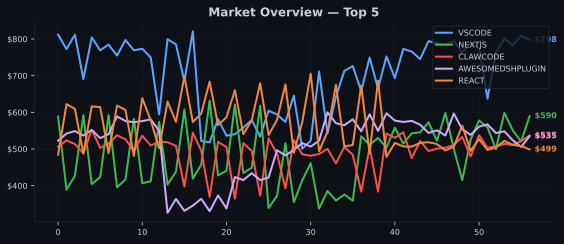

<div align="center">

# GitExchange

### The Stock Market for Open Source

**Trade GitHub repos like stocks. Prices driven by real stars, commits, and forks.**

Every repo is a ticker. Every issue is a trade. GitHub-native execution with optional Solana on-chain settlement.

🪙 **Governing Token:** `OKK` (`CFB81yp47VXeypR9VPqVdPPPtfVVTc47P4H5TzfWpump`)

🟢 **Market OPEN** | Total Cap: $7.35M | 56 Stocks | 2 Traders | Last Update: 2026-09-02 01:57 UTC

📈 **Top Gainer**: NEXTJS +48.44% ($539.46) | 📉 **Top Loser**: OMNIGENT -29.79% ($229.84)

---

[**Browse Market**](#market-board) | [**Leaderboard**](#leaderboard) | [**Start Trading**](#start-trading-now) | [**How It Works**](#how-prices-work)

</div>

---

## Quick Start

| Step | Action |
|:----:|--------|
| **1** | Click a **Buy** or **Sell** link below -- or open a new issue |
| **2** | Edit the quantity in the issue title (e.g. `BUY react 10`) |
| **3** | Submit -- your trade executes automatically and you get a receipt |
| **4** | Open an issue titled `PORTFOLIO` anytime to check your holdings |

> **Requirements** -- Your GitHub account must be at least **7 days old**. Limit: **5 trades per hour**.
>
> **On-chain mode (optional)** -- Add `wallet: <solana_wallet>` and `signature: <tx_signature>` in BUY issues to verify payment through Solana RPC.

---

## Start Trading Now

Pick a stock and open a trade in one click:

<div align="center">

| Buy | Sell | Short |
|:---:|:----:|:-----:|
| [Buy React](https://github.com/SolanaLeeky/GitExchange/issues/new?title=BUY+react+5&body=Adjust+quantity+then+submit) | [Sell React](https://github.com/SolanaLeeky/GitExchange/issues/new?title=SELL+react+5&body=Adjust+quantity+then+submit) | [Short React](https://github.com/SolanaLeeky/GitExchange/issues/new?title=SHORT+react+5&body=Adjust+quantity+then+submit) |
| [Buy VS Code](https://github.com/SolanaLeeky/GitExchange/issues/new?title=BUY+vscode+5&body=Adjust+quantity+then+submit) | [Sell VS Code](https://github.com/SolanaLeeky/GitExchange/issues/new?title=SELL+vscode+5&body=Adjust+quantity+then+submit) | [Short VS Code](https://github.com/SolanaLeeky/GitExchange/issues/new?title=SHORT+vscode+5&body=Adjust+quantity+then+submit) |
| [Buy Next.js](https://github.com/SolanaLeeky/GitExchange/issues/new?title=BUY+next.js+5&body=Adjust+quantity+then+submit) | [Sell Next.js](https://github.com/SolanaLeeky/GitExchange/issues/new?title=SELL+next.js+5&body=Adjust+quantity+then+submit) | [Short Next.js](https://github.com/SolanaLeeky/GitExchange/issues/new?title=SHORT+next.js+5&body=Adjust+quantity+then+submit) |
| [Buy Deno](https://github.com/SolanaLeeky/GitExchange/issues/new?title=BUY+deno+5&body=Adjust+quantity+then+submit) | [Sell Deno](https://github.com/SolanaLeeky/GitExchange/issues/new?title=SELL+deno+5&body=Adjust+quantity+then+submit) | [Short Deno](https://github.com/SolanaLeeky/GitExchange/issues/new?title=SHORT+deno+5&body=Adjust+quantity+then+submit) |

**[View Portfolio](https://github.com/SolanaLeeky/GitExchange/issues/new?title=PORTFOLIO&body=Submit+to+view+your+holdings)**

</div>

---

## Market Board

| Ticker | Name | Price | 24h Change | Volume | Market Cap | Trade |
|--------|------|-------|------------|--------|------------|-------|
| **VSCODE** | microsoft/vscode | $695.82 | 🔴 -3.24% | 3 | $347.9K | [Buy](https://github.com/barbrickdesign/GitExchange-enhancedByAgentR/issues/new?title=BUY+vscode+10&body=Adjust+quantity+in+the+title+then+submit) [Sell](https://github.com/barbrickdesign/GitExchange-enhancedByAgentR/issues/new?title=SELL+vscode+5&body=Adjust+quantity+in+the+title+then+submit) [Short](https://github.com/barbrickdesign/GitExchange-enhancedByAgentR/issues/new?title=SHORT+vscode+10&body=Adjust+quantity+in+the+title+then+submit) |
| **REACT** | facebook/react | $661.75 | 🟢 +5.60% | 22 | $330.9K | [Buy](https://github.com/barbrickdesign/GitExchange-enhancedByAgentR/issues/new?title=BUY+react+10&body=Adjust+quantity+in+the+title+then+submit) [Sell](https://github.com/barbrickdesign/GitExchange-enhancedByAgentR/issues/new?title=SELL+react+5&body=Adjust+quantity+in+the+title+then+submit) [Short](https://github.com/barbrickdesign/GitExchange-enhancedByAgentR/issues/new?title=SHORT+react+10&body=Adjust+quantity+in+the+title+then+submit) |
| **AWESOMEDSHPLUGIN** | awesome-dsh-plugin/awesome-dsh-plugin | $575.70 | 🟢 +0.16% | 0 | $287.9K | [Buy](https://github.com/barbrickdesign/GitExchange-enhancedByAgentR/issues/new?title=BUY+awesomedshplugin+10&body=Adjust+quantity+in+the+title+then+submit) [Sell](https://github.com/barbrickdesign/GitExchange-enhancedByAgentR/issues/new?title=SELL+awesomedshplugin+5&body=Adjust+quantity+in+the+title+then+submit) [Short](https://github.com/barbrickdesign/GitExchange-enhancedByAgentR/issues/new?title=SHORT+awesomedshplugin+10&body=Adjust+quantity+in+the+title+then+submit) |
| **CLAWCODE** | ultraworkers/claw-code | $542.95 | 🟢 +0.67% | 0 | $271.5K | [Buy](https://github.com/barbrickdesign/GitExchange-enhancedByAgentR/issues/new?title=BUY+clawcode+10&body=Adjust+quantity+in+the+title+then+submit) [Sell](https://github.com/barbrickdesign/GitExchange-enhancedByAgentR/issues/new?title=SELL+clawcode+5&body=Adjust+quantity+in+the+title+then+submit) [Short](https://github.com/barbrickdesign/GitExchange-enhancedByAgentR/issues/new?title=SHORT+clawcode+10&body=Adjust+quantity+in+the+title+then+submit) |
| **NEXTJS** | vercel/next.js | $539.46 | 🟢 +48.44% | 5 | $269.7K | [Buy](https://github.com/barbrickdesign/GitExchange-enhancedByAgentR/issues/new?title=BUY+nextjs+10&body=Adjust+quantity+in+the+title+then+submit) [Sell](https://github.com/barbrickdesign/GitExchange-enhancedByAgentR/issues/new?title=SELL+nextjs+5&body=Adjust+quantity+in+the+title+then+submit) [Short](https://github.com/barbrickdesign/GitExchange-enhancedByAgentR/issues/new?title=SHORT+nextjs+10&body=Adjust+quantity+in+the+title+then+submit) |
| **DENO** | denoland/deno | $443.67 | 🟢 +2.05% | 2 | $221.8K | [Buy](https://github.com/barbrickdesign/GitExchange-enhancedByAgentR/issues/new?title=BUY+deno+10&body=Adjust+quantity+in+the+title+then+submit) [Sell](https://github.com/barbrickdesign/GitExchange-enhancedByAgentR/issues/new?title=SELL+deno+5&body=Adjust+quantity+in+the+title+then+submit) [Short](https://github.com/barbrickdesign/GitExchange-enhancedByAgentR/issues/new?title=SHORT+deno+10&body=Adjust+quantity+in+the+title+then+submit) |
| **OPENDESIGN** | nexu-io/open-design | $427.11 | 🔴 -2.28% | 0 | $213.6K | [Buy](https://github.com/barbrickdesign/GitExchange-enhancedByAgentR/issues/new?title=BUY+opendesign+10&body=Adjust+quantity+in+the+title+then+submit) [Sell](https://github.com/barbrickdesign/GitExchange-enhancedByAgentR/issues/new?title=SELL+opendesign+5&body=Adjust+quantity+in+the+title+then+submit) [Short](https://github.com/barbrickdesign/GitExchange-enhancedByAgentR/issues/new?title=SHORT+opendesign+10&body=Adjust+quantity+in+the+title+then+submit) |
| **GRAPHIFY** | safishamsi/graphify | $400.89 | 🟢 +5.61% | 0 | $200.4K | [Buy](https://github.com/barbrickdesign/GitExchange-enhancedByAgentR/issues/new?title=BUY+graphify+10&body=Adjust+quantity+in+the+title+then+submit) [Sell](https://github.com/barbrickdesign/GitExchange-enhancedByAgentR/issues/new?title=SELL+graphify+5&body=Adjust+quantity+in+the+title+then+submit) [Short](https://github.com/barbrickdesign/GitExchange-enhancedByAgentR/issues/new?title=SHORT+graphify+10&body=Adjust+quantity+in+the+title+then+submit) |
| **PAPERCLIP** | paperclipai/paperclip | $398.23 | 🟢 +16.94% | 0 | $199.1K | [Buy](https://github.com/barbrickdesign/GitExchange-enhancedByAgentR/issues/new?title=BUY+paperclip+10&body=Adjust+quantity+in+the+title+then+submit) [Sell](https://github.com/barbrickdesign/GitExchange-enhancedByAgentR/issues/new?title=SELL+paperclip+5&body=Adjust+quantity+in+the+title+then+submit) [Short](https://github.com/barbrickdesign/GitExchange-enhancedByAgentR/issues/new?title=SHORT+paperclip+10&body=Adjust+quantity+in+the+title+then+submit) |
| **CAREEROPS** | santifer/career-ops | $380.39 | 🔴 -2.37% | 0 | $190.2K | [Buy](https://github.com/barbrickdesign/GitExchange-enhancedByAgentR/issues/new?title=BUY+careerops+10&body=Adjust+quantity+in+the+title+then+submit) [Sell](https://github.com/barbrickdesign/GitExchange-enhancedByAgentR/issues/new?title=SELL+careerops+5&body=Adjust+quantity+in+the+title+then+submit) [Short](https://github.com/barbrickdesign/GitExchange-enhancedByAgentR/issues/new?title=SHORT+careerops+10&body=Adjust+quantity+in+the+title+then+submit) |
| **ODYSSEUS** | pewdiepie-archdaemon/odysseus | $357.31 | 🟢 +7.28% | 0 | $178.7K | [Buy](https://github.com/barbrickdesign/GitExchange-enhancedByAgentR/issues/new?title=BUY+odysseus+10&body=Adjust+quantity+in+the+title+then+submit) [Sell](https://github.com/barbrickdesign/GitExchange-enhancedByAgentR/issues/new?title=SELL+odysseus+5&body=Adjust+quantity+in+the+title+then+submit) [Short](https://github.com/barbrickdesign/GitExchange-enhancedByAgentR/issues/new?title=SHORT+odysseus+10&body=Adjust+quantity+in+the+title+then+submit) |
| **GSTACK** | garrytan/gstack | $339.41 | 🟢 +1.26% | 20 | $169.7K | [Buy](https://github.com/barbrickdesign/GitExchange-enhancedByAgentR/issues/new?title=BUY+gstack+10&body=Adjust+quantity+in+the+title+then+submit) [Sell](https://github.com/barbrickdesign/GitExchange-enhancedByAgentR/issues/new?title=SELL+gstack+5&body=Adjust+quantity+in+the+title+then+submit) [Short](https://github.com/barbrickdesign/GitExchange-enhancedByAgentR/issues/new?title=SHORT+gstack+10&body=Adjust+quantity+in+the+title+then+submit) |
| **PONYTAIL** | DietrichGebert/ponytail | $318.56 | 🔴 -0.36% | 0 | $159.3K | [Buy](https://github.com/barbrickdesign/GitExchange-enhancedByAgentR/issues/new?title=BUY+ponytail+10&body=Adjust+quantity+in+the+title+then+submit) [Sell](https://github.com/barbrickdesign/GitExchange-enhancedByAgentR/issues/new?title=SELL+ponytail+5&body=Adjust+quantity+in+the+title+then+submit) [Short](https://github.com/barbrickdesign/GitExchange-enhancedByAgentR/issues/new?title=SHORT+ponytail+10&body=Adjust+quantity+in+the+title+then+submit) |
| **MEMPALACE** | milla-jovovich/mempalace | $286.43 | 🟢 +8.71% | 0 | $143.2K | [Buy](https://github.com/barbrickdesign/GitExchange-enhancedByAgentR/issues/new?title=BUY+mempalace+10&body=Adjust+quantity+in+the+title+then+submit) [Sell](https://github.com/barbrickdesign/GitExchange-enhancedByAgentR/issues/new?title=SELL+mempalace+5&body=Adjust+quantity+in+the+title+then+submit) [Short](https://github.com/barbrickdesign/GitExchange-enhancedByAgentR/issues/new?title=SHORT+mempalace+10&body=Adjust+quantity+in+the+title+then+submit) |
| **AWESOMEDESIGNMD** | VoltAgent/awesome-design-md | $278.76 | 🔴 -7.02% | 0 | $139.4K | [Buy](https://github.com/barbrickdesign/GitExchange-enhancedByAgentR/issues/new?title=BUY+awesomedesignmd+10&body=Adjust+quantity+in+the+title+then+submit) [Sell](https://github.com/barbrickdesign/GitExchange-enhancedByAgentR/issues/new?title=SELL+awesomedesignmd+5&body=Adjust+quantity+in+the+title+then+submit) [Short](https://github.com/barbrickdesign/GitExchange-enhancedByAgentR/issues/new?title=SHORT+awesomedesignmd+10&body=Adjust+quantity+in+the+title+then+submit) |
| **AUTORESEARCH** | karpathy/autoresearch | $259.83 | 🔴 -8.12% | 0 | $129.9K | [Buy](https://github.com/barbrickdesign/GitExchange-enhancedByAgentR/issues/new?title=BUY+autoresearch+10&body=Adjust+quantity+in+the+title+then+submit) [Sell](https://github.com/barbrickdesign/GitExchange-enhancedByAgentR/issues/new?title=SELL+autoresearch+5&body=Adjust+quantity+in+the+title+then+submit) [Short](https://github.com/barbrickdesign/GitExchange-enhancedByAgentR/issues/new?title=SHORT+autoresearch+10&body=Adjust+quantity+in+the+title+then+submit) |
| **CAVEMAN** | JuliusBrussee/caveman | $257.81 | 🔴 -13.08% | 0 | $128.9K | [Buy](https://github.com/barbrickdesign/GitExchange-enhancedByAgentR/issues/new?title=BUY+caveman+10&body=Adjust+quantity+in+the+title+then+submit) [Sell](https://github.com/barbrickdesign/GitExchange-enhancedByAgentR/issues/new?title=SELL+caveman+5&body=Adjust+quantity+in+the+title+then+submit) [Short](https://github.com/barbrickdesign/GitExchange-enhancedByAgentR/issues/new?title=SHORT+caveman+10&body=Adjust+quantity+in+the+title+then+submit) |
| **OPENCLAUDE** | Gitlawb/openclaude | $251.58 | 🟢 +6.22% | 0 | $125.8K | [Buy](https://github.com/barbrickdesign/GitExchange-enhancedByAgentR/issues/new?title=BUY+openclaude+10&body=Adjust+quantity+in+the+title+then+submit) [Sell](https://github.com/barbrickdesign/GitExchange-enhancedByAgentR/issues/new?title=SELL+openclaude+5&body=Adjust+quantity+in+the+title+then+submit) [Short](https://github.com/barbrickdesign/GitExchange-enhancedByAgentR/issues/new?title=SHORT+openclaude+10&body=Adjust+quantity+in+the+title+then+submit) |
| **CLIANYTHING** | HKUDS/CLI-Anything | $247.55 | 🟢 +2.89% | 5 | $123.8K | [Buy](https://github.com/barbrickdesign/GitExchange-enhancedByAgentR/issues/new?title=BUY+clianything+10&body=Adjust+quantity+in+the+title+then+submit) [Sell](https://github.com/barbrickdesign/GitExchange-enhancedByAgentR/issues/new?title=SELL+clianything+5&body=Adjust+quantity+in+the+title+then+submit) [Short](https://github.com/barbrickdesign/GitExchange-enhancedByAgentR/issues/new?title=SHORT+clianything+10&body=Adjust+quantity+in+the+title+then+submit) |
| **SVELTE** | sveltejs/svelte | $247.00 | 🔴 -29.12% | 6 | $123.5K | [Buy](https://github.com/barbrickdesign/GitExchange-enhancedByAgentR/issues/new?title=BUY+svelte+10&body=Adjust+quantity+in+the+title+then+submit) [Sell](https://github.com/barbrickdesign/GitExchange-enhancedByAgentR/issues/new?title=SELL+svelte+5&body=Adjust+quantity+in+the+title+then+submit) [Short](https://github.com/barbrickdesign/GitExchange-enhancedByAgentR/issues/new?title=SHORT+svelte+10&body=Adjust+quantity+in+the+title+then+submit) |
| **COLIBRI** | JustVugg/colibri | $245.16 | 🟢 +2.38% | 0 | $122.6K | [Buy](https://github.com/barbrickdesign/GitExchange-enhancedByAgentR/issues/new?title=BUY+colibri+10&body=Adjust+quantity+in+the+title+then+submit) [Sell](https://github.com/barbrickdesign/GitExchange-enhancedByAgentR/issues/new?title=SELL+colibri+5&body=Adjust+quantity+in+the+title+then+submit) [Short](https://github.com/barbrickdesign/GitExchange-enhancedByAgentR/issues/new?title=SHORT+colibri+10&body=Adjust+quantity+in+the+title+then+submit) |
| **GBRAIN** | garrytan/gbrain | $239.86 | 🟢 +5.72% | 0 | $119.9K | [Buy](https://github.com/barbrickdesign/GitExchange-enhancedByAgentR/issues/new?title=BUY+gbrain+10&body=Adjust+quantity+in+the+title+then+submit) [Sell](https://github.com/barbrickdesign/GitExchange-enhancedByAgentR/issues/new?title=SELL+gbrain+5&body=Adjust+quantity+in+the+title+then+submit) [Short](https://github.com/barbrickdesign/GitExchange-enhancedByAgentR/issues/new?title=SHORT+gbrain+10&body=Adjust+quantity+in+the+title+then+submit) |
| **OPENCODEREVIEW** | alibaba/open-code-review | $233.38 | 🟢 +2.68% | 0 | $116.7K | [Buy](https://github.com/barbrickdesign/GitExchange-enhancedByAgentR/issues/new?title=BUY+opencodereview+10&body=Adjust+quantity+in+the+title+then+submit) [Sell](https://github.com/barbrickdesign/GitExchange-enhancedByAgentR/issues/new?title=SELL+opencodereview+5&body=Adjust+quantity+in+the+title+then+submit) [Short](https://github.com/barbrickdesign/GitExchange-enhancedByAgentR/issues/new?title=SHORT+opencodereview+10&body=Adjust+quantity+in+the+title+then+submit) |
| **OMNIGENT** | omnigent-ai/omnigent | $229.84 | 🔴 -29.79% | 0 | $114.9K | [Buy](https://github.com/barbrickdesign/GitExchange-enhancedByAgentR/issues/new?title=BUY+omnigent+10&body=Adjust+quantity+in+the+title+then+submit) [Sell](https://github.com/barbrickdesign/GitExchange-enhancedByAgentR/issues/new?title=SELL+omnigent+5&body=Adjust+quantity+in+the+title+then+submit) [Short](https://github.com/barbrickdesign/GitExchange-enhancedByAgentR/issues/new?title=SHORT+omnigent+10&body=Adjust+quantity+in+the+title+then+submit) |
| **NEMOCLAW** | NVIDIA/NemoClaw | $221.83 | 🔴 -24.18% | 0 | $110.9K | [Buy](https://github.com/barbrickdesign/GitExchange-enhancedByAgentR/issues/new?title=BUY+nemoclaw+10&body=Adjust+quantity+in+the+title+then+submit) [Sell](https://github.com/barbrickdesign/GitExchange-enhancedByAgentR/issues/new?title=SELL+nemoclaw+5&body=Adjust+quantity+in+the+title+then+submit) [Short](https://github.com/barbrickdesign/GitExchange-enhancedByAgentR/issues/new?title=SHORT+nemoclaw+10&body=Adjust+quantity+in+the+title+then+submit) |
| **PRETEXT** | chenglou/pretext | $215.13 | 🟢 +3.54% | 0 | $107.6K | [Buy](https://github.com/barbrickdesign/GitExchange-enhancedByAgentR/issues/new?title=BUY+pretext+10&body=Adjust+quantity+in+the+title+then+submit) [Sell](https://github.com/barbrickdesign/GitExchange-enhancedByAgentR/issues/new?title=SELL+pretext+5&body=Adjust+quantity+in+the+title+then+submit) [Short](https://github.com/barbrickdesign/GitExchange-enhancedByAgentR/issues/new?title=SHORT+pretext+10&body=Adjust+quantity+in+the+title+then+submit) |
| **BROWSERHARNESS** | browser-use/browser-harness | $203.16 | 🟢 +4.65% | 0 | $101.6K | [Buy](https://github.com/barbrickdesign/GitExchange-enhancedByAgentR/issues/new?title=BUY+browserharness+10&body=Adjust+quantity+in+the+title+then+submit) [Sell](https://github.com/barbrickdesign/GitExchange-enhancedByAgentR/issues/new?title=SELL+browserharness+5&body=Adjust+quantity+in+the+title+then+submit) [Short](https://github.com/barbrickdesign/GitExchange-enhancedByAgentR/issues/new?title=SHORT+browserharness+10&body=Adjust+quantity+in+the+title+then+submit) |
| **DEEPSEEKHARNESSDESKTOP** | anywhere-labs/deepseek-harness-desktop | $200.28 | 🟢 +5.38% | 0 | $100.1K | [Buy](https://github.com/barbrickdesign/GitExchange-enhancedByAgentR/issues/new?title=BUY+deepseekharnessdesktop+10&body=Adjust+quantity+in+the+title+then+submit) [Sell](https://github.com/barbrickdesign/GitExchange-enhancedByAgentR/issues/new?title=SELL+deepseekharnessdesktop+5&body=Adjust+quantity+in+the+title+then+submit) [Short](https://github.com/barbrickdesign/GitExchange-enhancedByAgentR/issues/new?title=SHORT+deepseekharnessdesktop+10&body=Adjust+quantity+in+the+title+then+submit) |
| **DS4** | antirez/ds4 | $198.88 | 🔴 -0.67% | 0 | $99.4K | [Buy](https://github.com/barbrickdesign/GitExchange-enhancedByAgentR/issues/new?title=BUY+ds4+10&body=Adjust+quantity+in+the+title+then+submit) [Sell](https://github.com/barbrickdesign/GitExchange-enhancedByAgentR/issues/new?title=SELL+ds4+5&body=Adjust+quantity+in+the+title+then+submit) [Short](https://github.com/barbrickdesign/GitExchange-enhancedByAgentR/issues/new?title=SHORT+ds4+10&body=Adjust+quantity+in+the+title+then+submit) |
| **CLI** | googleworkspace/cli | $198.53 | 🟢 +0.04% | 0 | $99.3K | [Buy](https://github.com/barbrickdesign/GitExchange-enhancedByAgentR/issues/new?title=BUY+cli+10&body=Adjust+quantity+in+the+title+then+submit) [Sell](https://github.com/barbrickdesign/GitExchange-enhancedByAgentR/issues/new?title=SELL+cli+5&body=Adjust+quantity+in+the+title+then+submit) [Short](https://github.com/barbrickdesign/GitExchange-enhancedByAgentR/issues/new?title=SHORT+cli+10&body=Adjust+quantity+in+the+title+then+submit) |
| **DSHDESKTOP** | anywhere-labs/dsh-desktop | $197.78 | 🟢 +1.09% | 0 | $98.9K | [Buy](https://github.com/barbrickdesign/GitExchange-enhancedByAgentR/issues/new?title=BUY+dshdesktop+10&body=Adjust+quantity+in+the+title+then+submit) [Sell](https://github.com/barbrickdesign/GitExchange-enhancedByAgentR/issues/new?title=SELL+dshdesktop+5&body=Adjust+quantity+in+the+title+then+submit) [Short](https://github.com/barbrickdesign/GitExchange-enhancedByAgentR/issues/new?title=SHORT+dshdesktop+10&body=Adjust+quantity+in+the+title+then+submit) |
| **WATERMARKSREMOVER** | guillaumemeyer/watermarks-remover | $195.81 | 🔴 -5.82% | 0 | $97.9K | [Buy](https://github.com/barbrickdesign/GitExchange-enhancedByAgentR/issues/new?title=BUY+watermarksremover+10&body=Adjust+quantity+in+the+title+then+submit) [Sell](https://github.com/barbrickdesign/GitExchange-enhancedByAgentR/issues/new?title=SELL+watermarksremover+5&body=Adjust+quantity+in+the+title+then+submit) [Short](https://github.com/barbrickdesign/GitExchange-enhancedByAgentR/issues/new?title=SHORT+watermarksremover+10&body=Adjust+quantity+in+the+title+then+submit) |
| **OPENWORKER** | andrewyng/openworker | $193.98 | 🟢 +3.09% | 0 | $97.0K | [Buy](https://github.com/barbrickdesign/GitExchange-enhancedByAgentR/issues/new?title=BUY+openworker+10&body=Adjust+quantity+in+the+title+then+submit) [Sell](https://github.com/barbrickdesign/GitExchange-enhancedByAgentR/issues/new?title=SELL+openworker+5&body=Adjust+quantity+in+the+title+then+submit) [Short](https://github.com/barbrickdesign/GitExchange-enhancedByAgentR/issues/new?title=SHORT+openworker+10&body=Adjust+quantity+in+the+title+then+submit) |
| **OPENWIKI** | langchain-ai/openwiki | $192.96 | 🟢 +2.39% | 0 | $96.5K | [Buy](https://github.com/barbrickdesign/GitExchange-enhancedByAgentR/issues/new?title=BUY+openwiki+10&body=Adjust+quantity+in+the+title+then+submit) [Sell](https://github.com/barbrickdesign/GitExchange-enhancedByAgentR/issues/new?title=SELL+openwiki+5&body=Adjust+quantity+in+the+title+then+submit) [Short](https://github.com/barbrickdesign/GitExchange-enhancedByAgentR/issues/new?title=SHORT+openwiki+10&body=Adjust+quantity+in+the+title+then+submit) |
| **SKILLOPT** | microsoft/SkillOpt | $191.17 | 🟢 +1.08% | 0 | $95.6K | [Buy](https://github.com/barbrickdesign/GitExchange-enhancedByAgentR/issues/new?title=BUY+skillopt+10&body=Adjust+quantity+in+the+title+then+submit) [Sell](https://github.com/barbrickdesign/GitExchange-enhancedByAgentR/issues/new?title=SELL+skillopt+5&body=Adjust+quantity+in+the+title+then+submit) [Short](https://github.com/barbrickdesign/GitExchange-enhancedByAgentR/issues/new?title=SHORT+skillopt+10&body=Adjust+quantity+in+the+title+then+submit) |
| **MIMOCODE** | XiaomiMiMo/MiMo-Code | $186.48 | 🟢 +7.20% | 0 | $93.2K | [Buy](https://github.com/barbrickdesign/GitExchange-enhancedByAgentR/issues/new?title=BUY+mimocode+10&body=Adjust+quantity+in+the+title+then+submit) [Sell](https://github.com/barbrickdesign/GitExchange-enhancedByAgentR/issues/new?title=SELL+mimocode+5&body=Adjust+quantity+in+the+title+then+submit) [Short](https://github.com/barbrickdesign/GitExchange-enhancedByAgentR/issues/new?title=SHORT+mimocode+10&body=Adjust+quantity+in+the+title+then+submit) |
| **NUWASKILL** | alchaincyf/nuwa-skill | $184.75 | 🟢 +0.09% | 0 | $92.4K | [Buy](https://github.com/barbrickdesign/GitExchange-enhancedByAgentR/issues/new?title=BUY+nuwaskill+10&body=Adjust+quantity+in+the+title+then+submit) [Sell](https://github.com/barbrickdesign/GitExchange-enhancedByAgentR/issues/new?title=SELL+nuwaskill+5&body=Adjust+quantity+in+the+title+then+submit) [Short](https://github.com/barbrickdesign/GitExchange-enhancedByAgentR/issues/new?title=SHORT+nuwaskill+10&body=Adjust+quantity+in+the+title+then+submit) |
| **QM** | yc-software/qm | $184.49 | 🟢 +11.63% | 0 | $92.2K | [Buy](https://github.com/barbrickdesign/GitExchange-enhancedByAgentR/issues/new?title=BUY+qm+10&body=Adjust+quantity+in+the+title+then+submit) [Sell](https://github.com/barbrickdesign/GitExchange-enhancedByAgentR/issues/new?title=SELL+qm+5&body=Adjust+quantity+in+the+title+then+submit) [Short](https://github.com/barbrickdesign/GitExchange-enhancedByAgentR/issues/new?title=SHORT+qm+10&body=Adjust+quantity+in+the+title+then+submit) |
| **UNLIMITEDOCR** | baidu/Unlimited-OCR | $184.24 | 🔴 -3.49% | 0 | $92.1K | [Buy](https://github.com/barbrickdesign/GitExchange-enhancedByAgentR/issues/new?title=BUY+unlimitedocr+10&body=Adjust+quantity+in+the+title+then+submit) [Sell](https://github.com/barbrickdesign/GitExchange-enhancedByAgentR/issues/new?title=SELL+unlimitedocr+5&body=Adjust+quantity+in+the+title+then+submit) [Short](https://github.com/barbrickdesign/GitExchange-enhancedByAgentR/issues/new?title=SHORT+unlimitedocr+10&body=Adjust+quantity+in+the+title+then+submit) |
| **ANYDOC** | firecrawl/anydoc | $179.80 | 🟢 +1.73% | 0 | $89.9K | [Buy](https://github.com/barbrickdesign/GitExchange-enhancedByAgentR/issues/new?title=BUY+anydoc+10&body=Adjust+quantity+in+the+title+then+submit) [Sell](https://github.com/barbrickdesign/GitExchange-enhancedByAgentR/issues/new?title=SELL+anydoc+5&body=Adjust+quantity+in+the+title+then+submit) [Short](https://github.com/barbrickdesign/GitExchange-enhancedByAgentR/issues/new?title=SHORT+anydoc+10&body=Adjust+quantity+in+the+title+then+submit) |
| **IMG2THREEJS** | img2threejs/img2threejs | $174.62 | 🟢 +3.29% | 0 | $87.3K | [Buy](https://github.com/barbrickdesign/GitExchange-enhancedByAgentR/issues/new?title=BUY+img2threejs+10&body=Adjust+quantity+in+the+title+then+submit) [Sell](https://github.com/barbrickdesign/GitExchange-enhancedByAgentR/issues/new?title=SELL+img2threejs+5&body=Adjust+quantity+in+the+title+then+submit) [Short](https://github.com/barbrickdesign/GitExchange-enhancedByAgentR/issues/new?title=SHORT+img2threejs+10&body=Adjust+quantity+in+the+title+then+submit) |
| **ORCASLICERBAMBULAB** | FULU-Foundation/OrcaSlicer-bambulab | $169.37 | 🟢 +4.78% | 0 | $84.7K | [Buy](https://github.com/barbrickdesign/GitExchange-enhancedByAgentR/issues/new?title=BUY+orcaslicerbambulab+10&body=Adjust+quantity+in+the+title+then+submit) [Sell](https://github.com/barbrickdesign/GitExchange-enhancedByAgentR/issues/new?title=SELL+orcaslicerbambulab+5&body=Adjust+quantity+in+the+title+then+submit) [Short](https://github.com/barbrickdesign/GitExchange-enhancedByAgentR/issues/new?title=SHORT+orcaslicerbambulab+10&body=Adjust+quantity+in+the+title+then+submit) |
| **OPENMYTHOS** | kyegomez/OpenMythos | $167.07 | 🔴 -2.39% | 0 | $83.5K | [Buy](https://github.com/barbrickdesign/GitExchange-enhancedByAgentR/issues/new?title=BUY+openmythos+10&body=Adjust+quantity+in+the+title+then+submit) [Sell](https://github.com/barbrickdesign/GitExchange-enhancedByAgentR/issues/new?title=SELL+openmythos+5&body=Adjust+quantity+in+the+title+then+submit) [Short](https://github.com/barbrickdesign/GitExchange-enhancedByAgentR/issues/new?title=SHORT+openmythos+10&body=Adjust+quantity+in+the+title+then+submit) |
| **DEEPSPEC** | deepseek-ai/DeepSpec | $163.48 | 🟢 +4.99% | 0 | $81.7K | [Buy](https://github.com/barbrickdesign/GitExchange-enhancedByAgentR/issues/new?title=BUY+deepspec+10&body=Adjust+quantity+in+the+title+then+submit) [Sell](https://github.com/barbrickdesign/GitExchange-enhancedByAgentR/issues/new?title=SELL+deepspec+5&body=Adjust+quantity+in+the+title+then+submit) [Short](https://github.com/barbrickdesign/GitExchange-enhancedByAgentR/issues/new?title=SHORT+deepspec+10&body=Adjust+quantity+in+the+title+then+submit) |
| **CODEXDREAMSKIN** | Fei-Away/Codex-Dream-Skin | $161.66 | 🔴 -8.94% | 0 | $80.8K | [Buy](https://github.com/barbrickdesign/GitExchange-enhancedByAgentR/issues/new?title=BUY+codexdreamskin+10&body=Adjust+quantity+in+the+title+then+submit) [Sell](https://github.com/barbrickdesign/GitExchange-enhancedByAgentR/issues/new?title=SELL+codexdreamskin+5&body=Adjust+quantity+in+the+title+then+submit) [Short](https://github.com/barbrickdesign/GitExchange-enhancedByAgentR/issues/new?title=SHORT+codexdreamskin+10&body=Adjust+quantity+in+the+title+then+submit) |
| **AOSCE** | unicity-aos/aos-ce | $161.51 | 🔴 -1.37% | 0 | $80.8K | [Buy](https://github.com/barbrickdesign/GitExchange-enhancedByAgentR/issues/new?title=BUY+aosce+10&body=Adjust+quantity+in+the+title+then+submit) [Sell](https://github.com/barbrickdesign/GitExchange-enhancedByAgentR/issues/new?title=SELL+aosce+5&body=Adjust+quantity+in+the+title+then+submit) [Short](https://github.com/barbrickdesign/GitExchange-enhancedByAgentR/issues/new?title=SHORT+aosce+10&body=Adjust+quantity+in+the+title+then+submit) |
| **T3MP3ST** | elder-plinius/T3MP3ST | $161.46 | 🔴 -6.40% | 0 | $80.7K | [Buy](https://github.com/barbrickdesign/GitExchange-enhancedByAgentR/issues/new?title=BUY+t3mp3st+10&body=Adjust+quantity+in+the+title+then+submit) [Sell](https://github.com/barbrickdesign/GitExchange-enhancedByAgentR/issues/new?title=SELL+t3mp3st+5&body=Adjust+quantity+in+the+title+then+submit) [Short](https://github.com/barbrickdesign/GitExchange-enhancedByAgentR/issues/new?title=SHORT+t3mp3st+10&body=Adjust+quantity+in+the+title+then+submit) |
| **DIRTYFRAG** | V4bel/dirtyfrag | $159.55 | 🟢 +2.76% | 0 | $79.8K | [Buy](https://github.com/barbrickdesign/GitExchange-enhancedByAgentR/issues/new?title=BUY+dirtyfrag+10&body=Adjust+quantity+in+the+title+then+submit) [Sell](https://github.com/barbrickdesign/GitExchange-enhancedByAgentR/issues/new?title=SELL+dirtyfrag+5&body=Adjust+quantity+in+the+title+then+submit) [Short](https://github.com/barbrickdesign/GitExchange-enhancedByAgentR/issues/new?title=SHORT+dirtyfrag+10&body=Adjust+quantity+in+the+title+then+submit) |
| **KIMIK3** | MoonshotAI/Kimi-K3 | $159.46 | 🔴 -1.63% | 0 | $79.7K | [Buy](https://github.com/barbrickdesign/GitExchange-enhancedByAgentR/issues/new?title=BUY+kimik3+10&body=Adjust+quantity+in+the+title+then+submit) [Sell](https://github.com/barbrickdesign/GitExchange-enhancedByAgentR/issues/new?title=SELL+kimik3+5&body=Adjust+quantity+in+the+title+then+submit) [Short](https://github.com/barbrickdesign/GitExchange-enhancedByAgentR/issues/new?title=SHORT+kimik3+10&body=Adjust+quantity+in+the+title+then+submit) |
| **HUASHUDESIGN** | alchaincyf/huashu-design | $158.71 | 🔴 -2.07% | 0 | $79.4K | [Buy](https://github.com/barbrickdesign/GitExchange-enhancedByAgentR/issues/new?title=BUY+huashudesign+10&body=Adjust+quantity+in+the+title+then+submit) [Sell](https://github.com/barbrickdesign/GitExchange-enhancedByAgentR/issues/new?title=SELL+huashudesign+5&body=Adjust+quantity+in+the+title+then+submit) [Short](https://github.com/barbrickdesign/GitExchange-enhancedByAgentR/issues/new?title=SHORT+huashudesign+10&body=Adjust+quantity+in+the+title+then+submit) |
| **OSIRIS** | simplifaisoul/osiris | $157.14 | 🔴 -6.39% | 0 | $78.6K | [Buy](https://github.com/barbrickdesign/GitExchange-enhancedByAgentR/issues/new?title=BUY+osiris+10&body=Adjust+quantity+in+the+title+then+submit) [Sell](https://github.com/barbrickdesign/GitExchange-enhancedByAgentR/issues/new?title=SELL+osiris+5&body=Adjust+quantity+in+the+title+then+submit) [Short](https://github.com/barbrickdesign/GitExchange-enhancedByAgentR/issues/new?title=SHORT+osiris+10&body=Adjust+quantity+in+the+title+then+submit) |
| **IMPROVE** | shadcn/improve | $156.23 | 🔴 -5.14% | 0 | $78.1K | [Buy](https://github.com/barbrickdesign/GitExchange-enhancedByAgentR/issues/new?title=BUY+improve+10&body=Adjust+quantity+in+the+title+then+submit) [Sell](https://github.com/barbrickdesign/GitExchange-enhancedByAgentR/issues/new?title=SELL+improve+5&body=Adjust+quantity+in+the+title+then+submit) [Short](https://github.com/barbrickdesign/GitExchange-enhancedByAgentR/issues/new?title=SHORT+improve+10&body=Adjust+quantity+in+the+title+then+submit) |
| **SDKJS** | unicity-astrid/sdk-js | $152.77 | 🔴 -1.86% | 0 | $76.4K | [Buy](https://github.com/barbrickdesign/GitExchange-enhancedByAgentR/issues/new?title=BUY+sdkjs+10&body=Adjust+quantity+in+the+title+then+submit) [Sell](https://github.com/barbrickdesign/GitExchange-enhancedByAgentR/issues/new?title=SELL+sdkjs+5&body=Adjust+quantity+in+the+title+then+submit) [Short](https://github.com/barbrickdesign/GitExchange-enhancedByAgentR/issues/new?title=SHORT+sdkjs+10&body=Adjust+quantity+in+the+title+then+submit) |
| **DESIGNMD** | google-labs-code/design.md | $150.06 | 🔴 -21.12% | 0 | $75.0K | [Buy](https://github.com/barbrickdesign/GitExchange-enhancedByAgentR/issues/new?title=BUY+designmd+10&body=Adjust+quantity+in+the+title+then+submit) [Sell](https://github.com/barbrickdesign/GitExchange-enhancedByAgentR/issues/new?title=SELL+designmd+5&body=Adjust+quantity+in+the+title+then+submit) [Short](https://github.com/barbrickdesign/GitExchange-enhancedByAgentR/issues/new?title=SHORT+designmd+10&body=Adjust+quantity+in+the+title+then+submit) |
| **ZEROLANG** | vercel-labs/zerolang | $145.47 | 🔴 -1.26% | 0 | $72.7K | [Buy](https://github.com/barbrickdesign/GitExchange-enhancedByAgentR/issues/new?title=BUY+zerolang+10&body=Adjust+quantity+in+the+title+then+submit) [Sell](https://github.com/barbrickdesign/GitExchange-enhancedByAgentR/issues/new?title=SELL+zerolang+5&body=Adjust+quantity+in+the+title+then+submit) [Short](https://github.com/barbrickdesign/GitExchange-enhancedByAgentR/issues/new?title=SHORT+zerolang+10&body=Adjust+quantity+in+the+title+then+submit) |
| **HTMLANYTHING** | nexu-io/html-anything | $144.51 | 🔴 -8.67% | 0 | $72.3K | [Buy](https://github.com/barbrickdesign/GitExchange-enhancedByAgentR/issues/new?title=BUY+htmlanything+10&body=Adjust+quantity+in+the+title+then+submit) [Sell](https://github.com/barbrickdesign/GitExchange-enhancedByAgentR/issues/new?title=SELL+htmlanything+5&body=Adjust+quantity+in+the+title+then+submit) [Short](https://github.com/barbrickdesign/GitExchange-enhancedByAgentR/issues/new?title=SHORT+htmlanything+10&body=Adjust+quantity+in+the+title+then+submit) |

---

## Leaderboard

| Rank | Trader | Portfolio Value | P&L | Trades | Achievements |
|------|--------|-----------------|-----|--------|--------------|
| 🥇 | @SolanaLeeky | $25,672.11 | +$15,672.11 (+156.7%) | 12 | 🎯 📄 🔔 🐦 💎 |
| 🥈 | @neurobytex | $9,538.73 | -$461.27 (-4.6%) | 1 | 🎯 💎 🦊 |

---

## Price Chart (7 days)



---

## Recent Trades

*No trades yet.*

---

## Trading Commands

```
BUY   <ticker> <qty>     Buy shares              BUY react 10
SELL  <ticker> <qty>     Sell shares you own      SELL vscode 5
SHORT <ticker> <qty>     Bet on price drop        SHORT deno 20
COVER <ticker> <qty>     Close a short            COVER deno 20
PORTFOLIO                View your holdings
```

---

## Solana Settlement (Optional)

GitExchange now supports Solana RPC transaction verification for BUY execution:

- Submit a normal BUY issue title (`BUY <ticker> <qty>`)
- Add `wallet:` and `signature:` lines in the issue body
- AgentR verifies a confirmed transfer to the configured treasury wallet before settlement

Configuration lives in `data/config.json` under the `solana` section (`rpc_url`, `treasury_wallet`, `usd_per_sol`, and policy flags).

---

## AgentR Automation

AgentR orchestration and self-healing are built in:

- `engine/agentr_orchestrator.py` runs price updates, market events, rendering, and health checks with retry
- `engine/self_heal.py` repairs common state drift and validates integrity
- `.github/workflows/agentr-orchestrator.yml` runs end-to-end automation
- `.github/workflows/self-healing-ci.yml` runs compile + strict self-heal checks in CI

---

## Rules at a Glance

| | |
|---|---|
| **Starting cash** | $10,000 |
| **Trade size** | 1 -- 100 shares |
| **Max position** | 40% of portfolio in one stock |
| **Trading fee** | 0.1% per trade |
| **Short margin** | 150% of position value |
| **Price updates** | Every 6 hours via GitHub API |
| **Dividends** | Daily -- 0.5% of price to holders of repos with 50+ commits/week |

---

## How Prices Work

Stock prices reflect five real GitHub metrics, updated every 6 hours:

| Metric | Weight | What It Measures |
|--------|:------:|------------------|
| Stars | 30% | Community interest |
| Commits / week | 25% | Development momentum |
| Forks | 15% | Ecosystem adoption |
| Issue response time | 15% | Maintainer health |
| Contributors | 15% | Team breadth |

Momentum (trend-following, capped at 8%) and volatility (random +/-3%) are applied on top.

---

## Market Events

| Event | Trigger | Effect |
|-------|---------|--------|
| **IPO** | Trending repo hits 1,000+ stars | Auto-listed on the exchange |
| **Crash** | Repo archived or deleted | Price drops to $0 -- holders wiped |
| **Short Squeeze** | Short interest > 60% and price rises 10%+ | All shorts force-closed |
| **Dividends** | Repo has 50+ commits/week | Daily payout to shareholders |

---

## Achievements

| Badge | Name | How to Earn |
|:-----:|------|-------------|
| :dart: | **First Trade** | Complete your first trade |
| :100: | **Century Trader** | Make 100 trades |
| :rocket: | **10x Return** | Portfolio value reaches 10x starting cash |
| :gem: | **Diamond Hands** | Hold a stock for 30+ days |
| :page_facing_up: | **Paper Hands** | Sell within 1 hour of buying |
| :crown: | **Short King** | Profit $5,000+ from short positions |
| :globe_with_meridians: | **Diversified** | Hold 10+ different stocks |
| :whale: | **Whale** | Single trade worth $5,000+ |
| :shield: | **Survivor** | Hold a stock through a crash event |
| :bell: | **IPO Hunter** | Buy a stock on its IPO day |

---

## Profile Badge

Show off your trading stats on your GitHub profile! Open a `PORTFOLIO` issue to get your personalized badge with embed code.

**Example:**

[](https://github.com/SolanaLeeky/GitExchange)

Your badge updates automatically with every price update — rank, P&L, portfolio value, and trade count stay current.

---

<div align="center">

**GitExchange** -- Powered by GitHub Actions.

Prices update every 6 hours. Market data is committed to this repo.

[Open a Trade](https://github.com/SolanaLeeky/GitExchange/issues/new/choose) | [View Portfolio](https://github.com/SolanaLeeky/GitExchange/issues/new?title=PORTFOLIO&body=Submit+to+view+your+holdings)

</div>
