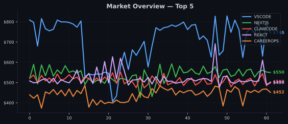

<div align="center">

# GitExchange

### The Stock Market for Open Source

**Trade GitHub repos like stocks. Prices driven by real stars, commits, and forks.**

Every repo is a ticker. Every issue is a trade. GitHub-native execution with optional Solana on-chain settlement.

🪙 **Governing Token:** `OKK` (`CFB81yp47VXeypR9VPqVdPPPtfVVTc47P4H5TzfWpump`)

🟢 **Market OPEN** | Total Cap: $9.29M | 72 Stocks | 2 Traders | Last Update: 2026-10-11 01:06 UTC

📈 **Top Gainer**: PAPERCLIP +39.48% ($423.42) | 📉 **Top Loser**: GBRAIN -52.40% ($232.31)

---

[**Browse Market**](#market-board) | [**Leaderboard**](#leaderboard) | [**Start Trading**](#start-trading-now) | [**How It Works**](#how-prices-work)

</div>

---

## Quick Start

| Step | Action |
|:----:|--------|
| **1** | Click a **Buy** or **Sell** link below -- or open a new issue |
| **2** | Edit the quantity in the issue title (e.g. `BUY react 10`) |
| **3** | Submit -- your trade executes automatically and you get a receipt |
| **4** | Open an issue titled `PORTFOLIO` anytime to check your holdings |

> **Requirements** -- Your GitHub account must be at least **7 days old**. Limit: **5 trades per hour**.
>
> **On-chain mode (optional)** -- Add `wallet: <solana_wallet>` and `signature: <tx_signature>` in BUY issues to verify payment through Solana RPC.

---

## Start Trading Now

Pick a stock and open a trade in one click:

<div align="center">

| Buy | Sell | Short |
|:---:|:----:|:-----:|
| [Buy React](https://github.com/SolanaLeeky/GitExchange/issues/new?title=BUY+react+5&body=Adjust+quantity+then+submit) | [Sell React](https://github.com/SolanaLeeky/GitExchange/issues/new?title=SELL+react+5&body=Adjust+quantity+then+submit) | [Short React](https://github.com/SolanaLeeky/GitExchange/issues/new?title=SHORT+react+5&body=Adjust+quantity+then+submit) |
| [Buy VS Code](https://github.com/SolanaLeeky/GitExchange/issues/new?title=BUY+vscode+5&body=Adjust+quantity+then+submit) | [Sell VS Code](https://github.com/SolanaLeeky/GitExchange/issues/new?title=SELL+vscode+5&body=Adjust+quantity+then+submit) | [Short VS Code](https://github.com/SolanaLeeky/GitExchange/issues/new?title=SHORT+vscode+5&body=Adjust+quantity+then+submit) |
| [Buy Next.js](https://github.com/SolanaLeeky/GitExchange/issues/new?title=BUY+next.js+5&body=Adjust+quantity+then+submit) | [Sell Next.js](https://github.com/SolanaLeeky/GitExchange/issues/new?title=SELL+next.js+5&body=Adjust+quantity+then+submit) | [Short Next.js](https://github.com/SolanaLeeky/GitExchange/issues/new?title=SHORT+next.js+5&body=Adjust+quantity+then+submit) |
| [Buy Deno](https://github.com/SolanaLeeky/GitExchange/issues/new?title=BUY+deno+5&body=Adjust+quantity+then+submit) | [Sell Deno](https://github.com/SolanaLeeky/GitExchange/issues/new?title=SELL+deno+5&body=Adjust+quantity+then+submit) | [Short Deno](https://github.com/SolanaLeeky/GitExchange/issues/new?title=SHORT+deno+5&body=Adjust+quantity+then+submit) |

**[View Portfolio](https://github.com/SolanaLeeky/GitExchange/issues/new?title=PORTFOLIO&body=Submit+to+view+your+holdings)**

</div>

---

## Market Board

| Ticker | Name | Price | 24h Change | Volume | Market Cap | Trade |
|--------|------|-------|------------|--------|------------|-------|
| **VSCODE** | microsoft/vscode | $669.75 | 🟢 +3.93% | 3 | $334.9K | [Buy](https://github.com/barbrickdesign/GitExchange-enhancedByAgentR/issues/new?title=BUY+vscode+10&body=Adjust+quantity+in+the+title+then+submit) [Sell](https://github.com/barbrickdesign/GitExchange-enhancedByAgentR/issues/new?title=SELL+vscode+5&body=Adjust+quantity+in+the+title+then+submit) [Short](https://github.com/barbrickdesign/GitExchange-enhancedByAgentR/issues/new?title=SHORT+vscode+10&body=Adjust+quantity+in+the+title+then+submit) |
| **REACT** | facebook/react | $663.46 | 🟢 +25.42% | 22 | $331.7K | [Buy](https://github.com/barbrickdesign/GitExchange-enhancedByAgentR/issues/new?title=BUY+react+10&body=Adjust+quantity+in+the+title+then+submit) [Sell](https://github.com/barbrickdesign/GitExchange-enhancedByAgentR/issues/new?title=SELL+react+5&body=Adjust+quantity+in+the+title+then+submit) [Short](https://github.com/barbrickdesign/GitExchange-enhancedByAgentR/issues/new?title=SHORT+react+10&body=Adjust+quantity+in+the+title+then+submit) |
| **PHOTOCRAFT** | storytold/photocraft | $556.60 | 🟢 +33.19% | 0 | $278.3K | [Buy](https://github.com/barbrickdesign/GitExchange-enhancedByAgentR/issues/new?title=BUY+photocraft+10&body=Adjust+quantity+in+the+title+then+submit) [Sell](https://github.com/barbrickdesign/GitExchange-enhancedByAgentR/issues/new?title=SELL+photocraft+5&body=Adjust+quantity+in+the+title+then+submit) [Short](https://github.com/barbrickdesign/GitExchange-enhancedByAgentR/issues/new?title=SHORT+photocraft+10&body=Adjust+quantity+in+the+title+then+submit) |
| **NEXTJS** | vercel/next.js | $539.65 | 🟢 +6.78% | 5 | $269.8K | [Buy](https://github.com/barbrickdesign/GitExchange-enhancedByAgentR/issues/new?title=BUY+nextjs+10&body=Adjust+quantity+in+the+title+then+submit) [Sell](https://github.com/barbrickdesign/GitExchange-enhancedByAgentR/issues/new?title=SELL+nextjs+5&body=Adjust+quantity+in+the+title+then+submit) [Short](https://github.com/barbrickdesign/GitExchange-enhancedByAgentR/issues/new?title=SHORT+nextjs+10&body=Adjust+quantity+in+the+title+then+submit) |
| **CLAWCODE** | ultraworkers/claw-code | $496.79 | 🟢 +2.37% | 0 | $248.4K | [Buy](https://github.com/barbrickdesign/GitExchange-enhancedByAgentR/issues/new?title=BUY+clawcode+10&body=Adjust+quantity+in+the+title+then+submit) [Sell](https://github.com/barbrickdesign/GitExchange-enhancedByAgentR/issues/new?title=SELL+clawcode+5&body=Adjust+quantity+in+the+title+then+submit) [Short](https://github.com/barbrickdesign/GitExchange-enhancedByAgentR/issues/new?title=SHORT+clawcode+10&body=Adjust+quantity+in+the+title+then+submit) |
| **CAREEROPS** | santifer/career-ops | $465.00 | 🟢 +15.00% | 0 | $232.5K | [Buy](https://github.com/barbrickdesign/GitExchange-enhancedByAgentR/issues/new?title=BUY+careerops+10&body=Adjust+quantity+in+the+title+then+submit) [Sell](https://github.com/barbrickdesign/GitExchange-enhancedByAgentR/issues/new?title=SELL+careerops+5&body=Adjust+quantity+in+the+title+then+submit) [Short](https://github.com/barbrickdesign/GitExchange-enhancedByAgentR/issues/new?title=SHORT+careerops+10&body=Adjust+quantity+in+the+title+then+submit) |
| **GRAPHIFY** | safishamsi/graphify | $445.18 | 🟢 +1.86% | 0 | $222.6K | [Buy](https://github.com/barbrickdesign/GitExchange-enhancedByAgentR/issues/new?title=BUY+graphify+10&body=Adjust+quantity+in+the+title+then+submit) [Sell](https://github.com/barbrickdesign/GitExchange-enhancedByAgentR/issues/new?title=SELL+graphify+5&body=Adjust+quantity+in+the+title+then+submit) [Short](https://github.com/barbrickdesign/GitExchange-enhancedByAgentR/issues/new?title=SHORT+graphify+10&body=Adjust+quantity+in+the+title+then+submit) |
| **STRATA** | Niko1221/Strata | $437.34 | 🟢 +26.39% | 0 | $218.7K | [Buy](https://github.com/barbrickdesign/GitExchange-enhancedByAgentR/issues/new?title=BUY+strata+10&body=Adjust+quantity+in+the+title+then+submit) [Sell](https://github.com/barbrickdesign/GitExchange-enhancedByAgentR/issues/new?title=SELL+strata+5&body=Adjust+quantity+in+the+title+then+submit) [Short](https://github.com/barbrickdesign/GitExchange-enhancedByAgentR/issues/new?title=SHORT+strata+10&body=Adjust+quantity+in+the+title+then+submit) |
| **OPENDESIGN** | nexu-io/open-design | $435.99 | 🟢 +12.12% | 0 | $218.0K | [Buy](https://github.com/barbrickdesign/GitExchange-enhancedByAgentR/issues/new?title=BUY+opendesign+10&body=Adjust+quantity+in+the+title+then+submit) [Sell](https://github.com/barbrickdesign/GitExchange-enhancedByAgentR/issues/new?title=SELL+opendesign+5&body=Adjust+quantity+in+the+title+then+submit) [Short](https://github.com/barbrickdesign/GitExchange-enhancedByAgentR/issues/new?title=SHORT+opendesign+10&body=Adjust+quantity+in+the+title+then+submit) |
| **PAPERCLIP** | paperclipai/paperclip | $423.42 | 🟢 +39.48% | 0 | $211.7K | [Buy](https://github.com/barbrickdesign/GitExchange-enhancedByAgentR/issues/new?title=BUY+paperclip+10&body=Adjust+quantity+in+the+title+then+submit) [Sell](https://github.com/barbrickdesign/GitExchange-enhancedByAgentR/issues/new?title=SELL+paperclip+5&body=Adjust+quantity+in+the+title+then+submit) [Short](https://github.com/barbrickdesign/GitExchange-enhancedByAgentR/issues/new?title=SHORT+paperclip+10&body=Adjust+quantity+in+the+title+then+submit) |
| **PONYTAIL** | DietrichGebert/ponytail | $415.25 | 🟢 +6.87% | 0 | $207.6K | [Buy](https://github.com/barbrickdesign/GitExchange-enhancedByAgentR/issues/new?title=BUY+ponytail+10&body=Adjust+quantity+in+the+title+then+submit) [Sell](https://github.com/barbrickdesign/GitExchange-enhancedByAgentR/issues/new?title=SELL+ponytail+5&body=Adjust+quantity+in+the+title+then+submit) [Short](https://github.com/barbrickdesign/GitExchange-enhancedByAgentR/issues/new?title=SHORT+ponytail+10&body=Adjust+quantity+in+the+title+then+submit) |
| **SVELTE** | sveltejs/svelte | $410.53 | 🟢 +25.10% | 6 | $205.3K | [Buy](https://github.com/barbrickdesign/GitExchange-enhancedByAgentR/issues/new?title=BUY+svelte+10&body=Adjust+quantity+in+the+title+then+submit) [Sell](https://github.com/barbrickdesign/GitExchange-enhancedByAgentR/issues/new?title=SELL+svelte+5&body=Adjust+quantity+in+the+title+then+submit) [Short](https://github.com/barbrickdesign/GitExchange-enhancedByAgentR/issues/new?title=SHORT+svelte+10&body=Adjust+quantity+in+the+title+then+submit) |
| **CAVEMAN** | JuliusBrussee/caveman | $373.42 | 🟢 +14.64% | 0 | $186.7K | [Buy](https://github.com/barbrickdesign/GitExchange-enhancedByAgentR/issues/new?title=BUY+caveman+10&body=Adjust+quantity+in+the+title+then+submit) [Sell](https://github.com/barbrickdesign/GitExchange-enhancedByAgentR/issues/new?title=SELL+caveman+5&body=Adjust+quantity+in+the+title+then+submit) [Short](https://github.com/barbrickdesign/GitExchange-enhancedByAgentR/issues/new?title=SHORT+caveman+10&body=Adjust+quantity+in+the+title+then+submit) |
| **GSTACK** | garrytan/gstack | $368.70 | 🟢 +18.75% | 20 | $184.3K | [Buy](https://github.com/barbrickdesign/GitExchange-enhancedByAgentR/issues/new?title=BUY+gstack+10&body=Adjust+quantity+in+the+title+then+submit) [Sell](https://github.com/barbrickdesign/GitExchange-enhancedByAgentR/issues/new?title=SELL+gstack+5&body=Adjust+quantity+in+the+title+then+submit) [Short](https://github.com/barbrickdesign/GitExchange-enhancedByAgentR/issues/new?title=SHORT+gstack+10&body=Adjust+quantity+in+the+title+then+submit) |
| **AWESOMEDSHPLUGIN** | awesome-dsh-plugin/awesome-dsh-plugin | $357.90 | 🟢 +2.39% | 0 | $178.9K | [Buy](https://github.com/barbrickdesign/GitExchange-enhancedByAgentR/issues/new?title=BUY+awesomedshplugin+10&body=Adjust+quantity+in+the+title+then+submit) [Sell](https://github.com/barbrickdesign/GitExchange-enhancedByAgentR/issues/new?title=SELL+awesomedshplugin+5&body=Adjust+quantity+in+the+title+then+submit) [Short](https://github.com/barbrickdesign/GitExchange-enhancedByAgentR/issues/new?title=SHORT+awesomedshplugin+10&body=Adjust+quantity+in+the+title+then+submit) |
| **PRETEXT** | chenglou/pretext | $355.18 | 🟢 +27.56% | 0 | $177.6K | [Buy](https://github.com/barbrickdesign/GitExchange-enhancedByAgentR/issues/new?title=BUY+pretext+10&body=Adjust+quantity+in+the+title+then+submit) [Sell](https://github.com/barbrickdesign/GitExchange-enhancedByAgentR/issues/new?title=SELL+pretext+5&body=Adjust+quantity+in+the+title+then+submit) [Short](https://github.com/barbrickdesign/GitExchange-enhancedByAgentR/issues/new?title=SHORT+pretext+10&body=Adjust+quantity+in+the+title+then+submit) |
| **ODYSSEUS** | pewdiepie-archdaemon/odysseus | $314.39 | 🔴 -2.89% | 0 | $157.2K | [Buy](https://github.com/barbrickdesign/GitExchange-enhancedByAgentR/issues/new?title=BUY+odysseus+10&body=Adjust+quantity+in+the+title+then+submit) [Sell](https://github.com/barbrickdesign/GitExchange-enhancedByAgentR/issues/new?title=SELL+odysseus+5&body=Adjust+quantity+in+the+title+then+submit) [Short](https://github.com/barbrickdesign/GitExchange-enhancedByAgentR/issues/new?title=SHORT+odysseus+10&body=Adjust+quantity+in+the+title+then+submit) |
| **LAYA** | NandhaKishorM/laya | $312.70 | 🟢 +17.42% | 0 | $156.3K | [Buy](https://github.com/barbrickdesign/GitExchange-enhancedByAgentR/issues/new?title=BUY+laya+10&body=Adjust+quantity+in+the+title+then+submit) [Sell](https://github.com/barbrickdesign/GitExchange-enhancedByAgentR/issues/new?title=SELL+laya+5&body=Adjust+quantity+in+the+title+then+submit) [Short](https://github.com/barbrickdesign/GitExchange-enhancedByAgentR/issues/new?title=SHORT+laya+10&body=Adjust+quantity+in+the+title+then+submit) |
| **OMNIGENT** | omnigent-ai/omnigent | $312.69 | 🟢 +7.71% | 0 | $156.3K | [Buy](https://github.com/barbrickdesign/GitExchange-enhancedByAgentR/issues/new?title=BUY+omnigent+10&body=Adjust+quantity+in+the+title+then+submit) [Sell](https://github.com/barbrickdesign/GitExchange-enhancedByAgentR/issues/new?title=SELL+omnigent+5&body=Adjust+quantity+in+the+title+then+submit) [Short](https://github.com/barbrickdesign/GitExchange-enhancedByAgentR/issues/new?title=SHORT+omnigent+10&body=Adjust+quantity+in+the+title+then+submit) |
| **COLIBRI** | JustVugg/colibri | $305.75 | 🟢 +11.17% | 0 | $152.9K | [Buy](https://github.com/barbrickdesign/GitExchange-enhancedByAgentR/issues/new?title=BUY+colibri+10&body=Adjust+quantity+in+the+title+then+submit) [Sell](https://github.com/barbrickdesign/GitExchange-enhancedByAgentR/issues/new?title=SELL+colibri+5&body=Adjust+quantity+in+the+title+then+submit) [Short](https://github.com/barbrickdesign/GitExchange-enhancedByAgentR/issues/new?title=SHORT+colibri+10&body=Adjust+quantity+in+the+title+then+submit) |
| **MEMPALACE** | milla-jovovich/mempalace | $289.88 | 🟢 +7.21% | 0 | $144.9K | [Buy](https://github.com/barbrickdesign/GitExchange-enhancedByAgentR/issues/new?title=BUY+mempalace+10&body=Adjust+quantity+in+the+title+then+submit) [Sell](https://github.com/barbrickdesign/GitExchange-enhancedByAgentR/issues/new?title=SELL+mempalace+5&body=Adjust+quantity+in+the+title+then+submit) [Short](https://github.com/barbrickdesign/GitExchange-enhancedByAgentR/issues/new?title=SHORT+mempalace+10&body=Adjust+quantity+in+the+title+then+submit) |
| **AUTORESEARCH** | karpathy/autoresearch | $288.52 | 🟢 +7.34% | 0 | $144.3K | [Buy](https://github.com/barbrickdesign/GitExchange-enhancedByAgentR/issues/new?title=BUY+autoresearch+10&body=Adjust+quantity+in+the+title+then+submit) [Sell](https://github.com/barbrickdesign/GitExchange-enhancedByAgentR/issues/new?title=SELL+autoresearch+5&body=Adjust+quantity+in+the+title+then+submit) [Short](https://github.com/barbrickdesign/GitExchange-enhancedByAgentR/issues/new?title=SHORT+autoresearch+10&body=Adjust+quantity+in+the+title+then+submit) |
| **AWESOMEDESIGNMD** | VoltAgent/awesome-design-md | $287.07 | 🔴 -2.45% | 0 | $143.5K | [Buy](https://github.com/barbrickdesign/GitExchange-enhancedByAgentR/issues/new?title=BUY+awesomedesignmd+10&body=Adjust+quantity+in+the+title+then+submit) [Sell](https://github.com/barbrickdesign/GitExchange-enhancedByAgentR/issues/new?title=SELL+awesomedesignmd+5&body=Adjust+quantity+in+the+title+then+submit) [Short](https://github.com/barbrickdesign/GitExchange-enhancedByAgentR/issues/new?title=SHORT+awesomedesignmd+10&body=Adjust+quantity+in+the+title+then+submit) |
| **DENO** | denoland/deno | $276.20 | 🔴 -19.33% | 2 | $138.1K | [Buy](https://github.com/barbrickdesign/GitExchange-enhancedByAgentR/issues/new?title=BUY+deno+10&body=Adjust+quantity+in+the+title+then+submit) [Sell](https://github.com/barbrickdesign/GitExchange-enhancedByAgentR/issues/new?title=SELL+deno+5&body=Adjust+quantity+in+the+title+then+submit) [Short](https://github.com/barbrickdesign/GitExchange-enhancedByAgentR/issues/new?title=SHORT+deno+10&body=Adjust+quantity+in+the+title+then+submit) |
| **NEMOCLAW** | NVIDIA/NemoClaw | $268.19 | 🟢 +8.65% | 0 | $134.1K | [Buy](https://github.com/barbrickdesign/GitExchange-enhancedByAgentR/issues/new?title=BUY+nemoclaw+10&body=Adjust+quantity+in+the+title+then+submit) [Sell](https://github.com/barbrickdesign/GitExchange-enhancedByAgentR/issues/new?title=SELL+nemoclaw+5&body=Adjust+quantity+in+the+title+then+submit) [Short](https://github.com/barbrickdesign/GitExchange-enhancedByAgentR/issues/new?title=SHORT+nemoclaw+10&body=Adjust+quantity+in+the+title+then+submit) |
| **OPENCODEREVIEW** | alibaba/open-code-review | $267.59 | 🟢 +1.74% | 0 | $133.8K | [Buy](https://github.com/barbrickdesign/GitExchange-enhancedByAgentR/issues/new?title=BUY+opencodereview+10&body=Adjust+quantity+in+the+title+then+submit) [Sell](https://github.com/barbrickdesign/GitExchange-enhancedByAgentR/issues/new?title=SELL+opencodereview+5&body=Adjust+quantity+in+the+title+then+submit) [Short](https://github.com/barbrickdesign/GitExchange-enhancedByAgentR/issues/new?title=SHORT+opencodereview+10&body=Adjust+quantity+in+the+title+then+submit) |
| **CLIANYTHING** | HKUDS/CLI-Anything | $265.33 | 🟢 +6.95% | 5 | $132.7K | [Buy](https://github.com/barbrickdesign/GitExchange-enhancedByAgentR/issues/new?title=BUY+clianything+10&body=Adjust+quantity+in+the+title+then+submit) [Sell](https://github.com/barbrickdesign/GitExchange-enhancedByAgentR/issues/new?title=SELL+clianything+5&body=Adjust+quantity+in+the+title+then+submit) [Short](https://github.com/barbrickdesign/GitExchange-enhancedByAgentR/issues/new?title=SHORT+clianything+10&body=Adjust+quantity+in+the+title+then+submit) |
| **OPENCLAUDE** | Gitlawb/openclaude | $256.12 | 🟢 +6.56% | 0 | $128.1K | [Buy](https://github.com/barbrickdesign/GitExchange-enhancedByAgentR/issues/new?title=BUY+openclaude+10&body=Adjust+quantity+in+the+title+then+submit) [Sell](https://github.com/barbrickdesign/GitExchange-enhancedByAgentR/issues/new?title=SELL+openclaude+5&body=Adjust+quantity+in+the+title+then+submit) [Short](https://github.com/barbrickdesign/GitExchange-enhancedByAgentR/issues/new?title=SHORT+openclaude+10&body=Adjust+quantity+in+the+title+then+submit) |
| **HOWTOLIVEBETTER** | eternity4719/HowToLiveBetter | $239.50 | 🟢 +1.32% | 0 | $119.8K | [Buy](https://github.com/barbrickdesign/GitExchange-enhancedByAgentR/issues/new?title=BUY+howtolivebetter+10&body=Adjust+quantity+in+the+title+then+submit) [Sell](https://github.com/barbrickdesign/GitExchange-enhancedByAgentR/issues/new?title=SELL+howtolivebetter+5&body=Adjust+quantity+in+the+title+then+submit) [Short](https://github.com/barbrickdesign/GitExchange-enhancedByAgentR/issues/new?title=SHORT+howtolivebetter+10&body=Adjust+quantity+in+the+title+then+submit) |
| **DSHWEB** | zhu1090093659/dsh-web | $235.17 | 🟢 +8.69% | 0 | $117.6K | [Buy](https://github.com/barbrickdesign/GitExchange-enhancedByAgentR/issues/new?title=BUY+dshweb+10&body=Adjust+quantity+in+the+title+then+submit) [Sell](https://github.com/barbrickdesign/GitExchange-enhancedByAgentR/issues/new?title=SELL+dshweb+5&body=Adjust+quantity+in+the+title+then+submit) [Short](https://github.com/barbrickdesign/GitExchange-enhancedByAgentR/issues/new?title=SHORT+dshweb+10&body=Adjust+quantity+in+the+title+then+submit) |
| **GBRAIN** | garrytan/gbrain | $232.31 | 🔴 -52.40% | 0 | $116.2K | [Buy](https://github.com/barbrickdesign/GitExchange-enhancedByAgentR/issues/new?title=BUY+gbrain+10&body=Adjust+quantity+in+the+title+then+submit) [Sell](https://github.com/barbrickdesign/GitExchange-enhancedByAgentR/issues/new?title=SELL+gbrain+5&body=Adjust+quantity+in+the+title+then+submit) [Short](https://github.com/barbrickdesign/GitExchange-enhancedByAgentR/issues/new?title=SHORT+gbrain+10&body=Adjust+quantity+in+the+title+then+submit) |
| **BROWSERHARNESS** | browser-use/browser-harness | $213.03 | 🟢 +1.69% | 0 | $106.5K | [Buy](https://github.com/barbrickdesign/GitExchange-enhancedByAgentR/issues/new?title=BUY+browserharness+10&body=Adjust+quantity+in+the+title+then+submit) [Sell](https://github.com/barbrickdesign/GitExchange-enhancedByAgentR/issues/new?title=SELL+browserharness+5&body=Adjust+quantity+in+the+title+then+submit) [Short](https://github.com/barbrickdesign/GitExchange-enhancedByAgentR/issues/new?title=SHORT+browserharness+10&body=Adjust+quantity+in+the+title+then+submit) |
| **OPENWIKI** | langchain-ai/openwiki | $211.81 | 🟢 +2.74% | 0 | $105.9K | [Buy](https://github.com/barbrickdesign/GitExchange-enhancedByAgentR/issues/new?title=BUY+openwiki+10&body=Adjust+quantity+in+the+title+then+submit) [Sell](https://github.com/barbrickdesign/GitExchange-enhancedByAgentR/issues/new?title=SELL+openwiki+5&body=Adjust+quantity+in+the+title+then+submit) [Short](https://github.com/barbrickdesign/GitExchange-enhancedByAgentR/issues/new?title=SHORT+openwiki+10&body=Adjust+quantity+in+the+title+then+submit) |
| **DSHDESKTOP** | anywhere-labs/dsh-desktop | $209.48 | 🟢 +5.39% | 0 | $104.7K | [Buy](https://github.com/barbrickdesign/GitExchange-enhancedByAgentR/issues/new?title=BUY+dshdesktop+10&body=Adjust+quantity+in+the+title+then+submit) [Sell](https://github.com/barbrickdesign/GitExchange-enhancedByAgentR/issues/new?title=SELL+dshdesktop+5&body=Adjust+quantity+in+the+title+then+submit) [Short](https://github.com/barbrickdesign/GitExchange-enhancedByAgentR/issues/new?title=SHORT+dshdesktop+10&body=Adjust+quantity+in+the+title+then+submit) |
| **DEEPSEEKHARNESSDESKTOP** | anywhere-labs/deepseek-harness-desktop | $208.06 | 🟢 +8.65% | 0 | $104.0K | [Buy](https://github.com/barbrickdesign/GitExchange-enhancedByAgentR/issues/new?title=BUY+deepseekharnessdesktop+10&body=Adjust+quantity+in+the+title+then+submit) [Sell](https://github.com/barbrickdesign/GitExchange-enhancedByAgentR/issues/new?title=SELL+deepseekharnessdesktop+5&body=Adjust+quantity+in+the+title+then+submit) [Short](https://github.com/barbrickdesign/GitExchange-enhancedByAgentR/issues/new?title=SHORT+deepseekharnessdesktop+10&body=Adjust+quantity+in+the+title+then+submit) |
| **OPENWORKER** | andrewyng/openworker | $198.35 | 🟢 +14.13% | 0 | $99.2K | [Buy](https://github.com/barbrickdesign/GitExchange-enhancedByAgentR/issues/new?title=BUY+openworker+10&body=Adjust+quantity+in+the+title+then+submit) [Sell](https://github.com/barbrickdesign/GitExchange-enhancedByAgentR/issues/new?title=SELL+openworker+5&body=Adjust+quantity+in+the+title+then+submit) [Short](https://github.com/barbrickdesign/GitExchange-enhancedByAgentR/issues/new?title=SHORT+openworker+10&body=Adjust+quantity+in+the+title+then+submit) |
| **COMPOSITOR** | robbietilton/Compositor | $197.58 | 🟢 +10.08% | 0 | $98.8K | [Buy](https://github.com/barbrickdesign/GitExchange-enhancedByAgentR/issues/new?title=BUY+compositor+10&body=Adjust+quantity+in+the+title+then+submit) [Sell](https://github.com/barbrickdesign/GitExchange-enhancedByAgentR/issues/new?title=SELL+compositor+5&body=Adjust+quantity+in+the+title+then+submit) [Short](https://github.com/barbrickdesign/GitExchange-enhancedByAgentR/issues/new?title=SHORT+compositor+10&body=Adjust+quantity+in+the+title+then+submit) |
| **CLI** | googleworkspace/cli | $194.02 | 🔴 -5.54% | 0 | $97.0K | [Buy](https://github.com/barbrickdesign/GitExchange-enhancedByAgentR/issues/new?title=BUY+cli+10&body=Adjust+quantity+in+the+title+then+submit) [Sell](https://github.com/barbrickdesign/GitExchange-enhancedByAgentR/issues/new?title=SELL+cli+5&body=Adjust+quantity+in+the+title+then+submit) [Short](https://github.com/barbrickdesign/GitExchange-enhancedByAgentR/issues/new?title=SHORT+cli+10&body=Adjust+quantity+in+the+title+then+submit) |
| **QM** | yc-software/qm | $191.99 | 🟢 +9.24% | 0 | $96.0K | [Buy](https://github.com/barbrickdesign/GitExchange-enhancedByAgentR/issues/new?title=BUY+qm+10&body=Adjust+quantity+in+the+title+then+submit) [Sell](https://github.com/barbrickdesign/GitExchange-enhancedByAgentR/issues/new?title=SELL+qm+5&body=Adjust+quantity+in+the+title+then+submit) [Short](https://github.com/barbrickdesign/GitExchange-enhancedByAgentR/issues/new?title=SHORT+qm+10&body=Adjust+quantity+in+the+title+then+submit) |
| **NUWASKILL** | alchaincyf/nuwa-skill | $186.23 | 🔴 -2.12% | 0 | $93.1K | [Buy](https://github.com/barbrickdesign/GitExchange-enhancedByAgentR/issues/new?title=BUY+nuwaskill+10&body=Adjust+quantity+in+the+title+then+submit) [Sell](https://github.com/barbrickdesign/GitExchange-enhancedByAgentR/issues/new?title=SELL+nuwaskill+5&body=Adjust+quantity+in+the+title+then+submit) [Short](https://github.com/barbrickdesign/GitExchange-enhancedByAgentR/issues/new?title=SHORT+nuwaskill+10&body=Adjust+quantity+in+the+title+then+submit) |
| **UNLIMITEDOCR** | baidu/Unlimited-OCR | $185.49 | 🟢 +2.08% | 0 | $92.7K | [Buy](https://github.com/barbrickdesign/GitExchange-enhancedByAgentR/issues/new?title=BUY+unlimitedocr+10&body=Adjust+quantity+in+the+title+then+submit) [Sell](https://github.com/barbrickdesign/GitExchange-enhancedByAgentR/issues/new?title=SELL+unlimitedocr+5&body=Adjust+quantity+in+the+title+then+submit) [Short](https://github.com/barbrickdesign/GitExchange-enhancedByAgentR/issues/new?title=SHORT+unlimitedocr+10&body=Adjust+quantity+in+the+title+then+submit) |
| **WATERMARKSREMOVER** | guillaumemeyer/watermarks-remover | $185.44 | 🔴 -6.38% | 0 | $92.7K | [Buy](https://github.com/barbrickdesign/GitExchange-enhancedByAgentR/issues/new?title=BUY+watermarksremover+10&body=Adjust+quantity+in+the+title+then+submit) [Sell](https://github.com/barbrickdesign/GitExchange-enhancedByAgentR/issues/new?title=SELL+watermarksremover+5&body=Adjust+quantity+in+the+title+then+submit) [Short](https://github.com/barbrickdesign/GitExchange-enhancedByAgentR/issues/new?title=SHORT+watermarksremover+10&body=Adjust+quantity+in+the+title+then+submit) |
| **OPENBOT** | CopilotKit/OpenBot | $176.68 | 🟢 +3.21% | 0 | $88.3K | [Buy](https://github.com/barbrickdesign/GitExchange-enhancedByAgentR/issues/new?title=BUY+openbot+10&body=Adjust+quantity+in+the+title+then+submit) [Sell](https://github.com/barbrickdesign/GitExchange-enhancedByAgentR/issues/new?title=SELL+openbot+5&body=Adjust+quantity+in+the+title+then+submit) [Short](https://github.com/barbrickdesign/GitExchange-enhancedByAgentR/issues/new?title=SHORT+openbot+10&body=Adjust+quantity+in+the+title+then+submit) |
| **DS4** | antirez/ds4 | $176.11 | 🔴 -8.75% | 0 | $88.1K | [Buy](https://github.com/barbrickdesign/GitExchange-enhancedByAgentR/issues/new?title=BUY+ds4+10&body=Adjust+quantity+in+the+title+then+submit) [Sell](https://github.com/barbrickdesign/GitExchange-enhancedByAgentR/issues/new?title=SELL+ds4+5&body=Adjust+quantity+in+the+title+then+submit) [Short](https://github.com/barbrickdesign/GitExchange-enhancedByAgentR/issues/new?title=SHORT+ds4+10&body=Adjust+quantity+in+the+title+then+submit) |
| **SKILLOPT** | microsoft/SkillOpt | $175.32 | 🔴 -4.18% | 0 | $87.7K | [Buy](https://github.com/barbrickdesign/GitExchange-enhancedByAgentR/issues/new?title=BUY+skillopt+10&body=Adjust+quantity+in+the+title+then+submit) [Sell](https://github.com/barbrickdesign/GitExchange-enhancedByAgentR/issues/new?title=SELL+skillopt+5&body=Adjust+quantity+in+the+title+then+submit) [Short](https://github.com/barbrickdesign/GitExchange-enhancedByAgentR/issues/new?title=SHORT+skillopt+10&body=Adjust+quantity+in+the+title+then+submit) |
| **T3MP3ST** | elder-plinius/T3MP3ST | $167.27 | 🔴 -0.13% | 0 | $83.6K | [Buy](https://github.com/barbrickdesign/GitExchange-enhancedByAgentR/issues/new?title=BUY+t3mp3st+10&body=Adjust+quantity+in+the+title+then+submit) [Sell](https://github.com/barbrickdesign/GitExchange-enhancedByAgentR/issues/new?title=SELL+t3mp3st+5&body=Adjust+quantity+in+the+title+then+submit) [Short](https://github.com/barbrickdesign/GitExchange-enhancedByAgentR/issues/new?title=SHORT+t3mp3st+10&body=Adjust+quantity+in+the+title+then+submit) |
| **ORCASLICERBAMBULAB** | FULU-Foundation/OrcaSlicer-bambulab | $165.75 | 🟢 +0.64% | 0 | $82.9K | [Buy](https://github.com/barbrickdesign/GitExchange-enhancedByAgentR/issues/new?title=BUY+orcaslicerbambulab+10&body=Adjust+quantity+in+the+title+then+submit) [Sell](https://github.com/barbrickdesign/GitExchange-enhancedByAgentR/issues/new?title=SELL+orcaslicerbambulab+5&body=Adjust+quantity+in+the+title+then+submit) [Short](https://github.com/barbrickdesign/GitExchange-enhancedByAgentR/issues/new?title=SHORT+orcaslicerbambulab+10&body=Adjust+quantity+in+the+title+then+submit) |
| **ANYDOC** | firecrawl/anydoc | $165.21 | 🔴 -3.71% | 0 | $82.6K | [Buy](https://github.com/barbrickdesign/GitExchange-enhancedByAgentR/issues/new?title=BUY+anydoc+10&body=Adjust+quantity+in+the+title+then+submit) [Sell](https://github.com/barbrickdesign/GitExchange-enhancedByAgentR/issues/new?title=SELL+anydoc+5&body=Adjust+quantity+in+the+title+then+submit) [Short](https://github.com/barbrickdesign/GitExchange-enhancedByAgentR/issues/new?title=SHORT+anydoc+10&body=Adjust+quantity+in+the+title+then+submit) |
| **OSIRIS** | simplifaisoul/osiris | $165.20 | 🟢 +3.13% | 0 | $82.6K | [Buy](https://github.com/barbrickdesign/GitExchange-enhancedByAgentR/issues/new?title=BUY+osiris+10&body=Adjust+quantity+in+the+title+then+submit) [Sell](https://github.com/barbrickdesign/GitExchange-enhancedByAgentR/issues/new?title=SELL+osiris+5&body=Adjust+quantity+in+the+title+then+submit) [Short](https://github.com/barbrickdesign/GitExchange-enhancedByAgentR/issues/new?title=SHORT+osiris+10&body=Adjust+quantity+in+the+title+then+submit) |
| **IMPROVE** | shadcn/improve | $164.63 | 🟢 +3.11% | 0 | $82.3K | [Buy](https://github.com/barbrickdesign/GitExchange-enhancedByAgentR/issues/new?title=BUY+improve+10&body=Adjust+quantity+in+the+title+then+submit) [Sell](https://github.com/barbrickdesign/GitExchange-enhancedByAgentR/issues/new?title=SELL+improve+5&body=Adjust+quantity+in+the+title+then+submit) [Short](https://github.com/barbrickdesign/GitExchange-enhancedByAgentR/issues/new?title=SHORT+improve+10&body=Adjust+quantity+in+the+title+then+submit) |
| **CODEXDREAMSKIN** | Fei-Away/Codex-Dream-Skin | $163.47 | 🔴 -3.20% | 0 | $81.7K | [Buy](https://github.com/barbrickdesign/GitExchange-enhancedByAgentR/issues/new?title=BUY+codexdreamskin+10&body=Adjust+quantity+in+the+title+then+submit) [Sell](https://github.com/barbrickdesign/GitExchange-enhancedByAgentR/issues/new?title=SELL+codexdreamskin+5&body=Adjust+quantity+in+the+title+then+submit) [Short](https://github.com/barbrickdesign/GitExchange-enhancedByAgentR/issues/new?title=SHORT+codexdreamskin+10&body=Adjust+quantity+in+the+title+then+submit) |
| **M3ECANVAS** | lnkiai/m3e-canvas | $161.50 | 🔴 -2.03% | 0 | $80.8K | [Buy](https://github.com/barbrickdesign/GitExchange-enhancedByAgentR/issues/new?title=BUY+m3ecanvas+10&body=Adjust+quantity+in+the+title+then+submit) [Sell](https://github.com/barbrickdesign/GitExchange-enhancedByAgentR/issues/new?title=SELL+m3ecanvas+5&body=Adjust+quantity+in+the+title+then+submit) [Short](https://github.com/barbrickdesign/GitExchange-enhancedByAgentR/issues/new?title=SHORT+m3ecanvas+10&body=Adjust+quantity+in+the+title+then+submit) |
| **OPENMYTHOS** | kyegomez/OpenMythos | $160.89 | 🔴 -6.25% | 0 | $80.4K | [Buy](https://github.com/barbrickdesign/GitExchange-enhancedByAgentR/issues/new?title=BUY+openmythos+10&body=Adjust+quantity+in+the+title+then+submit) [Sell](https://github.com/barbrickdesign/GitExchange-enhancedByAgentR/issues/new?title=SELL+openmythos+5&body=Adjust+quantity+in+the+title+then+submit) [Short](https://github.com/barbrickdesign/GitExchange-enhancedByAgentR/issues/new?title=SHORT+openmythos+10&body=Adjust+quantity+in+the+title+then+submit) |
| **AOSCE** | unicity-aos/aos-ce | $160.71 | 🟢 +0.02% | 0 | $80.4K | [Buy](https://github.com/barbrickdesign/GitExchange-enhancedByAgentR/issues/new?title=BUY+aosce+10&body=Adjust+quantity+in+the+title+then+submit) [Sell](https://github.com/barbrickdesign/GitExchange-enhancedByAgentR/issues/new?title=SELL+aosce+5&body=Adjust+quantity+in+the+title+then+submit) [Short](https://github.com/barbrickdesign/GitExchange-enhancedByAgentR/issues/new?title=SHORT+aosce+10&body=Adjust+quantity+in+the+title+then+submit) |
| **KIMIK3** | MoonshotAI/Kimi-K3 | $160.62 | 🟢 +0.29% | 0 | $80.3K | [Buy](https://github.com/barbrickdesign/GitExchange-enhancedByAgentR/issues/new?title=BUY+kimik3+10&body=Adjust+quantity+in+the+title+then+submit) [Sell](https://github.com/barbrickdesign/GitExchange-enhancedByAgentR/issues/new?title=SELL+kimik3+5&body=Adjust+quantity+in+the+title+then+submit) [Short](https://github.com/barbrickdesign/GitExchange-enhancedByAgentR/issues/new?title=SHORT+kimik3+10&body=Adjust+quantity+in+the+title+then+submit) |
| **DEEPSPEC** | deepseek-ai/DeepSpec | $160.26 | 🟢 +2.10% | 0 | $80.1K | [Buy](https://github.com/barbrickdesign/GitExchange-enhancedByAgentR/issues/new?title=BUY+deepspec+10&body=Adjust+quantity+in+the+title+then+submit) [Sell](https://github.com/barbrickdesign/GitExchange-enhancedByAgentR/issues/new?title=SELL+deepspec+5&body=Adjust+quantity+in+the+title+then+submit) [Short](https://github.com/barbrickdesign/GitExchange-enhancedByAgentR/issues/new?title=SHORT+deepspec+10&body=Adjust+quantity+in+the+title+then+submit) |
| **HUASHUDESIGN** | alchaincyf/huashu-design | $159.41 | 🔴 -4.08% | 0 | $79.7K | [Buy](https://github.com/barbrickdesign/GitExchange-enhancedByAgentR/issues/new?title=BUY+huashudesign+10&body=Adjust+quantity+in+the+title+then+submit) [Sell](https://github.com/barbrickdesign/GitExchange-enhancedByAgentR/issues/new?title=SELL+huashudesign+5&body=Adjust+quantity+in+the+title+then+submit) [Short](https://github.com/barbrickdesign/GitExchange-enhancedByAgentR/issues/new?title=SHORT+huashudesign+10&body=Adjust+quantity+in+the+title+then+submit) |
| **KEV** | jaredpalmer/kev | $159.34 | 🔴 -2.44% | 0 | $79.7K | [Buy](https://github.com/barbrickdesign/GitExchange-enhancedByAgentR/issues/new?title=BUY+kev+10&body=Adjust+quantity+in+the+title+then+submit) [Sell](https://github.com/barbrickdesign/GitExchange-enhancedByAgentR/issues/new?title=SELL+kev+5&body=Adjust+quantity+in+the+title+then+submit) [Short](https://github.com/barbrickdesign/GitExchange-enhancedByAgentR/issues/new?title=SHORT+kev+10&body=Adjust+quantity+in+the+title+then+submit) |
| **THREEUI** | MengTo/threeui | $158.55 | 🟢 +0.65% | 0 | $79.3K | [Buy](https://github.com/barbrickdesign/GitExchange-enhancedByAgentR/issues/new?title=BUY+threeui+10&body=Adjust+quantity+in+the+title+then+submit) [Sell](https://github.com/barbrickdesign/GitExchange-enhancedByAgentR/issues/new?title=SELL+threeui+5&body=Adjust+quantity+in+the+title+then+submit) [Short](https://github.com/barbrickdesign/GitExchange-enhancedByAgentR/issues/new?title=SHORT+threeui+10&body=Adjust+quantity+in+the+title+then+submit) |
| **CODEXWITHCHATGPT** | XiaoDuoYa/codex-with-chatgpt | $158.01 | 🟢 +0.21% | 0 | $79.0K | [Buy](https://github.com/barbrickdesign/GitExchange-enhancedByAgentR/issues/new?title=BUY+codexwithchatgpt+10&body=Adjust+quantity+in+the+title+then+submit) [Sell](https://github.com/barbrickdesign/GitExchange-enhancedByAgentR/issues/new?title=SELL+codexwithchatgpt+5&body=Adjust+quantity+in+the+title+then+submit) [Short](https://github.com/barbrickdesign/GitExchange-enhancedByAgentR/issues/new?title=SHORT+codexwithchatgpt+10&body=Adjust+quantity+in+the+title+then+submit) |
| **DSHROUTINGSUITE** | yjh051108/dsh-routing-suite | $157.64 | 🟢 +2.43% | 0 | $78.8K | [Buy](https://github.com/barbrickdesign/GitExchange-enhancedByAgentR/issues/new?title=BUY+dshroutingsuite+10&body=Adjust+quantity+in+the+title+then+submit) [Sell](https://github.com/barbrickdesign/GitExchange-enhancedByAgentR/issues/new?title=SELL+dshroutingsuite+5&body=Adjust+quantity+in+the+title+then+submit) [Short](https://github.com/barbrickdesign/GitExchange-enhancedByAgentR/issues/new?title=SHORT+dshroutingsuite+10&body=Adjust+quantity+in+the+title+then+submit) |
| **AMAGINE3D** | amagine-ai/Amagine3D | $157.27 | 🔴 -2.82% | 0 | $78.6K | [Buy](https://github.com/barbrickdesign/GitExchange-enhancedByAgentR/issues/new?title=BUY+amagine3d+10&body=Adjust+quantity+in+the+title+then+submit) [Sell](https://github.com/barbrickdesign/GitExchange-enhancedByAgentR/issues/new?title=SELL+amagine3d+5&body=Adjust+quantity+in+the+title+then+submit) [Short](https://github.com/barbrickdesign/GitExchange-enhancedByAgentR/issues/new?title=SHORT+amagine3d+10&body=Adjust+quantity+in+the+title+then+submit) |
| **SDKJS** | unicity-astrid/sdk-js | $156.51 | 🔴 -1.89% | 0 | $78.3K | [Buy](https://github.com/barbrickdesign/GitExchange-enhancedByAgentR/issues/new?title=BUY+sdkjs+10&body=Adjust+quantity+in+the+title+then+submit) [Sell](https://github.com/barbrickdesign/GitExchange-enhancedByAgentR/issues/new?title=SELL+sdkjs+5&body=Adjust+quantity+in+the+title+then+submit) [Short](https://github.com/barbrickdesign/GitExchange-enhancedByAgentR/issues/new?title=SHORT+sdkjs+10&body=Adjust+quantity+in+the+title+then+submit) |
| **DLSS5SWAPPER** | rakanki911/DLSS5-Swapper | $155.17 | 🔴 -2.34% | 0 | $77.6K | [Buy](https://github.com/barbrickdesign/GitExchange-enhancedByAgentR/issues/new?title=BUY+dlss5swapper+10&body=Adjust+quantity+in+the+title+then+submit) [Sell](https://github.com/barbrickdesign/GitExchange-enhancedByAgentR/issues/new?title=SELL+dlss5swapper+5&body=Adjust+quantity+in+the+title+then+submit) [Short](https://github.com/barbrickdesign/GitExchange-enhancedByAgentR/issues/new?title=SHORT+dlss5swapper+10&body=Adjust+quantity+in+the+title+then+submit) |
| **PRAXIST** | sapientinc/PRAXIST | $152.34 | 🔴 -1.09% | 0 | $76.2K | [Buy](https://github.com/barbrickdesign/GitExchange-enhancedByAgentR/issues/new?title=BUY+praxist+10&body=Adjust+quantity+in+the+title+then+submit) [Sell](https://github.com/barbrickdesign/GitExchange-enhancedByAgentR/issues/new?title=SELL+praxist+5&body=Adjust+quantity+in+the+title+then+submit) [Short](https://github.com/barbrickdesign/GitExchange-enhancedByAgentR/issues/new?title=SHORT+praxist+10&body=Adjust+quantity+in+the+title+then+submit) |
| **FASTJEVCOMPACTION** | tamaratran/fast-jev-compaction | $150.50 | 🔴 -3.58% | 0 | $75.2K | [Buy](https://github.com/barbrickdesign/GitExchange-enhancedByAgentR/issues/new?title=BUY+fastjevcompaction+10&body=Adjust+quantity+in+the+title+then+submit) [Sell](https://github.com/barbrickdesign/GitExchange-enhancedByAgentR/issues/new?title=SELL+fastjevcompaction+5&body=Adjust+quantity+in+the+title+then+submit) [Short](https://github.com/barbrickdesign/GitExchange-enhancedByAgentR/issues/new?title=SHORT+fastjevcompaction+10&body=Adjust+quantity+in+the+title+then+submit) |
| **DESIGNMD** | google-labs-code/design.md | $142.80 | 🔴 -22.53% | 0 | $71.4K | [Buy](https://github.com/barbrickdesign/GitExchange-enhancedByAgentR/issues/new?title=BUY+designmd+10&body=Adjust+quantity+in+the+title+then+submit) [Sell](https://github.com/barbrickdesign/GitExchange-enhancedByAgentR/issues/new?title=SELL+designmd+5&body=Adjust+quantity+in+the+title+then+submit) [Short](https://github.com/barbrickdesign/GitExchange-enhancedByAgentR/issues/new?title=SHORT+designmd+10&body=Adjust+quantity+in+the+title+then+submit) |
| **DIRTYFRAG** | V4bel/dirtyfrag | $137.70 | 🔴 -4.94% | 0 | $68.8K | [Buy](https://github.com/barbrickdesign/GitExchange-enhancedByAgentR/issues/new?title=BUY+dirtyfrag+10&body=Adjust+quantity+in+the+title+then+submit) [Sell](https://github.com/barbrickdesign/GitExchange-enhancedByAgentR/issues/new?title=SELL+dirtyfrag+5&body=Adjust+quantity+in+the+title+then+submit) [Short](https://github.com/barbrickdesign/GitExchange-enhancedByAgentR/issues/new?title=SHORT+dirtyfrag+10&body=Adjust+quantity+in+the+title+then+submit) |
| **IMG2THREEJS** | img2threejs/img2threejs | $137.13 | 🔴 -19.11% | 0 | $68.6K | [Buy](https://github.com/barbrickdesign/GitExchange-enhancedByAgentR/issues/new?title=BUY+img2threejs+10&body=Adjust+quantity+in+the+title+then+submit) [Sell](https://github.com/barbrickdesign/GitExchange-enhancedByAgentR/issues/new?title=SELL+img2threejs+5&body=Adjust+quantity+in+the+title+then+submit) [Short](https://github.com/barbrickdesign/GitExchange-enhancedByAgentR/issues/new?title=SHORT+img2threejs+10&body=Adjust+quantity+in+the+title+then+submit) |
| **MIMOCODE** | XiaomiMiMo/MiMo-Code | $136.39 | 🔴 -12.45% | 0 | $68.2K | [Buy](https://github.com/barbrickdesign/GitExchange-enhancedByAgentR/issues/new?title=BUY+mimocode+10&body=Adjust+quantity+in+the+title+then+submit) [Sell](https://github.com/barbrickdesign/GitExchange-enhancedByAgentR/issues/new?title=SELL+mimocode+5&body=Adjust+quantity+in+the+title+then+submit) [Short](https://github.com/barbrickdesign/GitExchange-enhancedByAgentR/issues/new?title=SHORT+mimocode+10&body=Adjust+quantity+in+the+title+then+submit) |
| **HTMLANYTHING** | nexu-io/html-anything | $130.02 | 🔴 -16.65% | 0 | $65.0K | [Buy](https://github.com/barbrickdesign/GitExchange-enhancedByAgentR/issues/new?title=BUY+htmlanything+10&body=Adjust+quantity+in+the+title+then+submit) [Sell](https://github.com/barbrickdesign/GitExchange-enhancedByAgentR/issues/new?title=SELL+htmlanything+5&body=Adjust+quantity+in+the+title+then+submit) [Short](https://github.com/barbrickdesign/GitExchange-enhancedByAgentR/issues/new?title=SHORT+htmlanything+10&body=Adjust+quantity+in+the+title+then+submit) |
| **ZEROLANG** | vercel-labs/zerolang | $114.05 | 🔴 -17.16% | 0 | $57.0K | [Buy](https://github.com/barbrickdesign/GitExchange-enhancedByAgentR/issues/new?title=BUY+zerolang+10&body=Adjust+quantity+in+the+title+then+submit) [Sell](https://github.com/barbrickdesign/GitExchange-enhancedByAgentR/issues/new?title=SELL+zerolang+5&body=Adjust+quantity+in+the+title+then+submit) [Short](https://github.com/barbrickdesign/GitExchange-enhancedByAgentR/issues/new?title=SHORT+zerolang+10&body=Adjust+quantity+in+the+title+then+submit) |

---

## Leaderboard

| Rank | Trader | Portfolio Value | P&L | Trades | Achievements |
|------|--------|-----------------|-----|--------|--------------|
| 🥇 | @SolanaLeeky | $30,515.14 | +$20,515.14 (+205.2%) | 12 | 🎯 📄 🔔 🐦 💎 |
| 🥈 | @neurobytex | $9,547.28 | -$452.72 (-4.5%) | 1 | 🎯 💎 🦊 |

---

## Price Chart (7 days)



---

## Recent Trades

*No trades yet.*

---

## Trading Commands

```
BUY   <ticker> <qty>     Buy shares              BUY react 10
SELL  <ticker> <qty>     Sell shares you own      SELL vscode 5
SHORT <ticker> <qty>     Bet on price drop        SHORT deno 20
COVER <ticker> <qty>     Close a short            COVER deno 20
PORTFOLIO                View your holdings
```

---

## Solana Settlement (Optional)

GitExchange now supports Solana RPC transaction verification for BUY execution:

- Submit a normal BUY issue title (`BUY <ticker> <qty>`)
- Add `wallet:` and `signature:` lines in the issue body
- AgentR verifies a confirmed transfer to the configured treasury wallet before settlement

Configuration lives in `data/config.json` under the `solana` section (`rpc_url`, `treasury_wallet`, `usd_per_sol`, and policy flags).

---

## AgentR Automation

AgentR orchestration and self-healing are built in:

- `engine/agentr_orchestrator.py` runs price updates, market events, rendering, and health checks with retry
- `engine/self_heal.py` repairs common state drift and validates integrity
- `.github/workflows/agentr-orchestrator.yml` runs end-to-end automation
- `.github/workflows/self-healing-ci.yml` runs compile + strict self-heal checks in CI

---

## Rules at a Glance

| | |
|---|---|
| **Starting cash** | $10,000 |
| **Trade size** | 1 -- 100 shares |
| **Max position** | 40% of portfolio in one stock |
| **Trading fee** | 0.1% per trade |
| **Short margin** | 150% of position value |
| **Price updates** | Every 6 hours via GitHub API |
| **Dividends** | Daily -- 0.5% of price to holders of repos with 50+ commits/week |

---

## How Prices Work

Stock prices reflect five real GitHub metrics, updated every 6 hours:

| Metric | Weight | What It Measures |
|--------|:------:|------------------|
| Stars | 30% | Community interest |
| Commits / week | 25% | Development momentum |
| Forks | 15% | Ecosystem adoption |
| Issue response time | 15% | Maintainer health |
| Contributors | 15% | Team breadth |

Momentum (trend-following, capped at 8%) and volatility (random +/-3%) are applied on top.

---

## Market Events

| Event | Trigger | Effect |
|-------|---------|--------|
| **IPO** | Trending repo hits 1,000+ stars | Auto-listed on the exchange |
| **Crash** | Repo archived or deleted | Price drops to $0 -- holders wiped |
| **Short Squeeze** | Short interest > 60% and price rises 10%+ | All shorts force-closed |
| **Dividends** | Repo has 50+ commits/week | Daily payout to shareholders |

---

## Achievements

| Badge | Name | How to Earn |
|:-----:|------|-------------|
| :dart: | **First Trade** | Complete your first trade |
| :100: | **Century Trader** | Make 100 trades |
| :rocket: | **10x Return** | Portfolio value reaches 10x starting cash |
| :gem: | **Diamond Hands** | Hold a stock for 30+ days |
| :page_facing_up: | **Paper Hands** | Sell within 1 hour of buying |
| :crown: | **Short King** | Profit $5,000+ from short positions |
| :globe_with_meridians: | **Diversified** | Hold 10+ different stocks |
| :whale: | **Whale** | Single trade worth $5,000+ |
| :shield: | **Survivor** | Hold a stock through a crash event |
| :bell: | **IPO Hunter** | Buy a stock on its IPO day |

---

## Profile Badge

Show off your trading stats on your GitHub profile! Open a `PORTFOLIO` issue to get your personalized badge with embed code.

**Example:**

[](https://github.com/SolanaLeeky/GitExchange)

Your badge updates automatically with every price update — rank, P&L, portfolio value, and trade count stay current.

---

<div align="center">

**GitExchange** -- Powered by GitHub Actions.

Prices update every 6 hours. Market data is committed to this repo.

[Open a Trade](https://github.com/SolanaLeeky/GitExchange/issues/new/choose) | [View Portfolio](https://github.com/SolanaLeeky/GitExchange/issues/new?title=PORTFOLIO&body=Submit+to+view+your+holdings)

</div>
